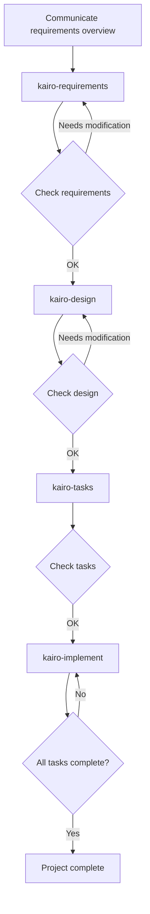

# Tsumiki Manual

## Usage

### Setup

Before using the project, first copy the contents of the `commands` directory to Claude's command directory:

```bash
# Copy the project's commands directory to .claude/commands
cp -r commands ~/.claude/commands/

# Or, within the project directory
mkdir -p .claude
cp -r commands .claude/
```

### TDD Commands

If determined as `TDD` during TASK creation and you want to execute the TDD process individually, you can run the following commands sequentially:

```
# TDD requirements definition
/tdd-requirements task-file-name TASK-number

# Test case creation
/tdd-testcases task-file-name TASK-number

# Automated from test implementation to TDD completion verification
/tdd-cycle-full.sh "task-file-name TASK-number"

# Test implementation (Red)
/tdd-red task-file-name TASK-number

# Minimal implementation (Green)
/tdd-green task-file-name TASK-number

# Refactoring
/tdd-refactor task-file-name TASK-number

# TDD completion verification
/tdd-verify-complete task-file-name TASK-number
```

### DIRECT Commands

If determined as `DIRECT` during TASK creation, you can run the following commands sequentially:

```
# DIRECT setup
/direct-setup task-file-name TASK-number

# DIRECT verification
/direct-verify task-file-name TASK-number
```

### Kairo Commands (Comprehensive Flow)

#### 1. Requirements Definition

First, communicate the project requirements overview to Kairo:

```
/kairo-requirements requirements-overview

# Prompt example:
# "I want to implement a product review feature for an e-commerce site.
#  Users can post 5-level ratings and comments for products,
#  and can reference other users' reviews."
```

Kairo generates the following:
- User stories
- Detailed requirements definition using EARS notation
- Edge case considerations
- Acceptance criteria

Generated file: `/docs/spec/{requirements-name}-requirements.md`

#### 2. Design

After confirming and modifying requirements, request design:

```
/kairo-design (or can be omitted)

# Please inform that requirements have been approved
```

Kairo generates the following:
- Architecture design document
- Data flow diagram (Mermaid)
- TypeScript interface definitions
- Database schema
- API endpoint specifications

Generated files: Under `/docs/design/{requirements-name}/`

#### 3. Task Division

After confirming the design (approval can be omitted), execute task division:

```
/kairo-tasks

# Please inform that the design has been approved (or can be omitted)
```

It is recommended to run `/kairo-task-verify` to verify task contents.

Kairo generates the following:
- Task list considering dependencies
- Details of each task (including test requirements, UI/UX requirements)
- Execution order and schedule

Generated file: `/docs/tasks/{requirements-name}-tasks.md`

#### 4. Implementation

After confirming tasks, start implementation:
(Manual execution of TDD cycle or DIRECT is recommended)

```
# Implement all tasks in order
/kairo-implement

# Implement only specific tasks
/kairo-implement task-file-name TASK-number
# "Please implement TASK-101"
```

Kairo internally uses TDD commands for each task to execute the following process:
1. TDD requirements definition (tdd-requirements)
2. Test case creation (tdd-testcases)
3. Test implementation (tdd-red)
4. Minimal implementation (tdd-green)
5. Refactoring (tdd-refactor)
6. TDD completion verification (tdd-verify-complete)

### Reverse Engineering Commands

If you want to reverse-generate various documents from an existing codebase, you can run the following commands sequentially:

```
# Analyze task structure from existing code
/rev-tasks

# Reverse generation of design documents (recommended after task analysis)
/rev-design

# Reverse generation of test specifications (recommended after design documents)
/rev-specs

# Reverse generation of requirements definition (recommended after complete analysis)
/rev-requirements
```

#### Reverse Engineering Details

##### Overview

Reverse engineering commands analyze existing codebases and generate various documents by reverse-calculating from implementation.

##### Recommended Execution Order

1. **rev-tasks** - Analyze the entire codebase to understand task structure
2. **rev-design** - Generate architecture and design documents
3. **rev-specs** - Generate test specifications and test cases
4. **rev-requirements** - Finally generate requirements definition document

##### Command Details

###### rev-tasks (Task Structure Analysis)

**Purpose**: Extract and organize implemented features as tasks from existing code

**Generated Files**:
- `docs/reverse/{project-name}-discovered-tasks.md`

**Analysis Content**:
- Understanding codebase structure
- Identifying implemented features
- Extracting API endpoints
- Analyzing database structure
- Estimating task dependencies

###### rev-design (Design Document Reverse Generation)

**Purpose**: Generate technical design documents from implemented architecture

**Generated Files**:
- `docs/reverse/{project-name}-architecture.md`
- `docs/reverse/{project-name}-dataflow.md`
- `docs/reverse/{project-name}-api-specs.md`
- `docs/reverse/{project-name}-database.md`
- `docs/reverse/{project-name}-interfaces.ts`

**Analysis Content**:
- Identifying architecture patterns
- Extracting data flow
- Extracting API specifications
- Reverse generating database schema
- Organizing TypeScript type definitions

###### rev-specs (Test Specification Reverse Generation)

**Purpose**: Reverse generate test cases and specifications from implementation code

**Generated Files**:
- `docs/reverse/{project-name}-test-specs.md`
- `docs/reverse/{project-name}-test-cases.md`
- `docs/reverse/tests/` - Generated test code

**Analysis Content**:
- Analyzing existing tests
- Identifying missing test cases
- Generating API test cases
- Generating UI component tests
- Proposing performance and security tests

###### rev-requirements (Requirements Definition Reverse Generation)

**Purpose**: Reverse generate requirements definition document in EARS notation from implemented features

**Generated Files**:
- `docs/reverse/{project-name}-requirements.md`

**Analysis Content**:
- Reverse calculating user stories
- Requirements classification using EARS notation
- Estimating non-functional requirements
- Identifying edge cases
- Generating acceptance criteria

##### Usage Examples

```bash
# Complete reverse analysis of project
/rev-tasks
# → Understand task structure

/rev-design
# → Document architecture and design

/rev-specs
# → Analyze test status and identify missing tests

/rev-requirements
# → Finally generate requirements definition document
```

##### Notes

- Please review the content generated at each step
- Estimated requirements may differ from actual business requirements
- Test cases are estimated from implementation status and may not be complete

## Directory Structure

```
/projects/ai/test18/
├── .claude/
│   └── commands/           # Kairo commands
├── docs/
│   ├── spec/              # Requirements definition documents
│   ├── design/            # Design documents
│   ├── tasks/             # Task lists
│   └── reverse/           # Reverse documents
├── implementation/        # Implementation code
│   └── {requirements-name}/
│       └── {task-ID}/
├── backend/              # Backend code
├── frontend/             # Frontend code
└── database/             # Database related
```

## Workflow Example



## Benefits

1. **Consistent Development Process**
   - Unified flow from requirements to implementation
   - Clear requirements definition using EARS notation

2. **Quality Assurance**
   - Robust implementation through TDD commands
   - Comprehensive test coverage

3. **Efficient Development**
   - Automatic task division and prioritization
   - Dependency visualization

4. **Comprehensive Documentation**
   - Requirements, design, and implementation are all documented
   - Easy to reference later

## Notes

- User confirmation is requested at each step
- Please review generated content
- Adjustments may be necessary according to project characteristics

## Troubleshooting

### Q: What if requirements are too complex?
A: Split requirements into multiple smaller features and run Kairo for each.

### Q: Can it be applied to existing codebases?
A: Yes. After analyzing existing code, it can be used for adding new features or modifications.

### Q: Is customization possible?
A: Yes. Each command file can be edited for project-specific customization.

## Support

If you have problems or questions, please report them to the project's issue tracker.