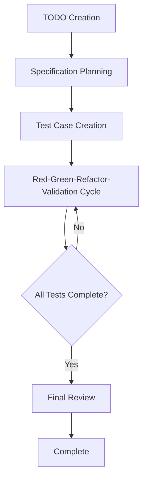

# 3.1 Overall Flow of Extended TDD Process

## Overview of AITDD Process

AITDD is an extended development methodology that combines the power of AI with traditional TDD (Test-Driven Development), adding a **Validation** step. Through collaboration between humans and AI, high-quality software can be developed efficiently.

## Structure of Overall Flow



### Basic Process Flow

```
TODO Creation → Specification Planning → Test Case Creation → Red-Green-Refactor-Validation → Final Review
```

## Details of Each Step

### 1. TODO Creation (Handled by Humans)

**Purpose**: Clearly define development tasks and break them into appropriate work units

**Work Content**:
- Identify functional requirements
- Break down development tasks
- Set priorities
- Clarify work scope

**Deliverable**: TODO.md file
- Task list in specific, implementable units
- Priority and dependencies for each task
- Definition of completion criteria

### 2. Specification Planning (Handled by Humans, Review Required)

**Purpose**: Develop detailed technical specifications from TODOs

**Work Content**:
- Define detailed functional specifications
- Clarify input/output
- Establish error handling policies
- Set performance requirements

**Important Points**:
- **Human review is mandatory**
- Use AI suggestions as reference, but humans make final decisions
- Eliminate ambiguity in specifications

**Deliverable**: requirements.md file
- Detailed functional requirements
- Technical constraints
- Quality requirements

### 3. Test Case Creation (Handled by Humans, Review Required)

**Purpose**: Design comprehensive test cases based on specifications

**Work Content**:
- Design normal path test cases
- Design abnormal path test cases
- Plan boundary value tests
- Identify edge cases

**Important Points**:
- **Human review is mandatory**
- Ensure comprehensive test case coverage
- Verify consistency with specifications

**Deliverable**: testcases.md file
- List of test cases
- Details of expected behavior
- Test data definitions

### 4. Red-Green-Refactor-Validation Cycle (Primarily Handled by AI)

This extends the traditional TDD cycle by adding a **Validation** step. This cycle is almost entirely executed by AI, but under human supervision.

#### Red (Test Failure)
- Implement test cases
- Confirm expected failures
- Execute tests and confirm failures

#### Green (Minimal Implementation)
- Minimal implementation to pass tests
- Automatic code generation by AI
- Confirm test success

#### Refactor (Refactoring)
- Improve code quality
- Optimization by AI
- Enhance readability and maintainability

#### Validation (Verification)
- Validate implementation appropriateness
- Quality checks
- Confirm additional verification items

### 5. Final Review (Handled by Humans)

**Purpose**: Final confirmation of overall quality and specification compliance of generated code

**Work Content**:
- Detailed review of source code
- Confirm consistency with specifications
- Security checks
- Performance verification

**Important Points**:
- **Must be performed by humans**
- Final quality assurance of AI-generated code
- Last line of defense before production deployment

## Role Division Between AI and Humans

### Areas Handled by AI (Claude, etc.)

- **Execution of Red-Green-Refactor-Validation Cycle**
  - Implementation of test cases
  - Generation of production code
  - Execution of refactoring
  - Support for quality verification

- **Code Generation and Optimization**
  - Implementation of efficient algorithms
  - Implementation following coding conventions
  - Automatic code improvement

- **Automated Test Execution**
  - Test execution and result confirmation
  - Test coverage measurement
  - Continuous quality checks

### Areas Handled by Humans

- **Strategic Decisions**
  - Specification planning and review
  - Test case design and review
  - Architecture decisions

- **Quality Management**
  - Final source code review
  - Security requirement confirmation
  - Business requirement compliance confirmation

- **Creative Work**
  - Problem-solving approach decisions
  - User experience design
  - Technology choice decisions

## Comparison with Traditional TDD

| Item | Traditional TDD | AITDD |
|------|---------|--------|
| **Cycle** | Red-Green-Refactor | Red-Green-Refactor-**Validation** |
| **Implementation Lead** | Human | **AI** (under human supervision) |
| **Review** | Only after implementation | **Specification・Test・Final Code** |
| **Speed** | Depends on human implementation speed | **Significantly accelerated with AI support** |
| **Quality Management** | Depends on developer skills | **Multi-layered quality checks** |
| **Learning Cost** | Need to master TDD | **TDD + AI utilization skills** |

## Process Benefits

### 1. Improved Development Speed
- Significantly reduced implementation time through automatic code generation by AI
- Automation of repetitive tasks
- Accelerated test execution and feedback

### 2. Improved Quality
- Additional quality checks through Validation step
- Double-check system with humans and AI
- Application of consistent quality standards

### 3. Knowledge Utilization
- Utilization of latest technologies and best practices by AI
- High-quality code generation even by inexperienced developers
- Automatic utilization of domain knowledge

### 4. Continuous Improvement
- Learning effects through AI feedback
- Continuous optimization of the process itself
- Team-wide skill improvement

## Precautions and Risk Management

### 1. Avoiding Excessive AI Dependence
- Important decisions must always be made by humans
- Do not blindly accept AI suggestions
- Continuously deepen technical understanding

### 2. Strengthening Quality Management
- Implement reviews at multiple stages
- Combine automated and manual testing
- Ensure reliable confirmation of security requirements

### 3. Process Flexibility
- Adjust process according to project
- Apply according to team skill level
- Continuous process improvement

## Next Steps

Chapter 3 will explain each step of this process in detail:

- [3.2 TODO Creation and Specification Planning](./02-todo-and-specification.md)
- [3.3 Test Case Creation](./03-test-case-creation.md)
- [3.4 Red-Green-Refactor-Validation Cycle](./04-rgr-validation-cycle.md)
- [3.5 Details of Validation Step](./05-validation-details.md)

Learn specific procedures and techniques for each step to become able to practice AITDD in real situations.