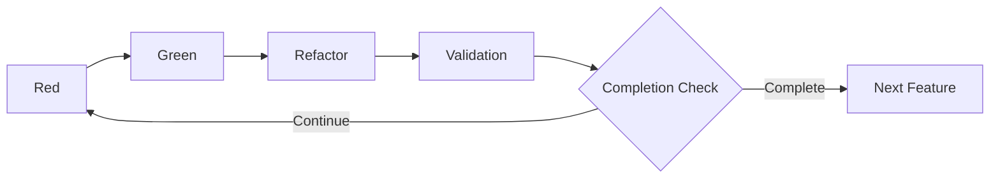

# 3.4 Red-Green-Refactor-Validation Cycle

## Overview of Extended TDD Cycle

The core of AITDD is an extended cycle that adds a **Validation** step to traditional TDD (Red-Green-Refactor). This cycle is primarily executed by AI but under human supervision, efficiently generating high-quality code.



## Red-Green-Refactor-Validation Cycle Details

### Red Phase: Confirming Test Failures

#### Purpose
- Implement test cases
- Confirm tests fail as expected
- Verify the validity of tests themselves

#### Specific Work Content

##### 1. Test Case Implementation
```javascript
// Example: User registration feature test implementation
describe('User Registration', () => {
  test('should create user with valid data', async () => {
    const userData = {
      email: 'test@example.com',
      password: 'SecurePass123!',
      password_confirmation: 'SecurePass123!'
    };
    
    const response = await request(app)
      .post('/api/users')
      .send(userData);
    
    expect(response.status).toBe(201);
    expect(response.body).toHaveProperty('id');
    expect(response.body.email).toBe(userData.email);
    
    // Database verification
    const user = await User.findByEmail(userData.email);
    expect(user).toBeTruthy();
    expect(user.password_hash).not.toBe(userData.password);
  });
  
  test('should reject duplicate email', async () => {
    // Pre-create existing user
    await createUser({ email: 'existing@example.com' });
    
    const duplicateData = {
      email: 'existing@example.com',
      password: 'NewPass456!'
    };
    
    const response = await request(app)
      .post('/api/users')
      .send(duplicateData);
    
    expect(response.status).toBe(400);
    expect(response.body.error).toBe('validation_failed');
    expect(response.body.details[0].field).toBe('email');
  });
});
```

##### 2. Test Execution and Failure Confirmation
```bash
$ npm test
❌ User Registration › should create user with valid data
   Error: Cannot POST /api/users
   
❌ User Registration › should reject duplicate email
   Error: Cannot POST /api/users
```

##### 3. Failure Reason Confirmation
- Endpoint not implemented
- Missing required dependencies
- Test environment configuration issues

#### AI Execution of Red Phase

##### Prompt Example
```markdown
## Instruction: Execute Red Phase

### Background
- Feature: User Registration API
- Test case specifications: See testcases.md
- Existing code: Check src/ directory

### Execution Content
1. Implement each test case from testcases.md as Jest tests
2. Run tests and confirm they fail as expected
3. Organize and report failure reasons

### Output Format
- Test code (complete version)
- Test execution results
- Analysis of failure reasons
- Suggestions for next Green phase
```

### Green Phase: Minimal Implementation

#### Purpose
- Implement minimal code to pass tests
- Avoid excessive implementation and maintain test-driven approach
- Leave room for improvement in the next Refactor phase

#### Specific Work Content

##### 1. Minimal API Implementation
```javascript
// routes/users.js
const express = require('express');
const bcrypt = require('bcrypt');
const User = require('../models/User');
const router = express.Router();

router.post('/users', async (req, res) => {
  try {
    const { email, password, password_confirmation } = req.body;
    
    // Basic validation
    if (!email || !password || !password_confirmation) {
      return res.status(400).json({
        error: 'validation_failed',
        details: [{ field: 'required', message: 'Missing required fields' }]
      });
    }
    
    if (password !== password_confirmation) {
      return res.status(400).json({
        error: 'validation_failed',
        details: [{ field: 'password', message: 'Password confirmation does not match' }]
      });
    }
    
    // Duplicate check
    const existingUser = await User.findByEmail(email);
    if (existingUser) {
      return res.status(400).json({
        error: 'validation_failed',
        details: [{ field: 'email', message: 'Email already exists' }]
      });
    }
    
    // Password hashing
    const password_hash = await bcrypt.hash(password, 10);
    
    // User creation
    const user = await User.create({
      email,
      password_hash
    });
    
    res.status(201).json({
      id: user.id,
      email: user.email,
      created_at: user.created_at
    });
    
  } catch (error) {
    console.error('User creation error:', error);
    res.status(500).json({ error: 'Internal server error' });
  }
});

module.exports = router;
```

##### 2. Minimal Model Implementation
```javascript
// models/User.js
const db = require('../database');

class User {
  static async findByEmail(email) {
    const result = await db.query(
      'SELECT * FROM users WHERE email = ?',
      [email]
    );
    return result[0] || null;
  }
  
  static async create({ email, password_hash }) {
    const result = await db.query(
      'INSERT INTO users (email, password_hash, created_at) VALUES (?, ?, NOW())',
      [email, password_hash]
    );
    
    return {
      id: result.insertId,
      email,
      created_at: new Date()
    };
  }
}

module.exports = User;
```

##### 3. Test Execution and Success Confirmation
```bash
$ npm test
✅ User Registration › should create user with valid data
✅ User Registration › should reject duplicate email

Tests: 2 passed, 2 total
```

#### AI Execution of Green Phase

##### Prompt Example
```markdown
## Instruction: Execute Green Phase

### Background
- Failing tests: [Red phase results]
- Requirements: See requirements.md
- Existing code structure: Check src/ directory

### Execution Content
1. Minimal implementation to pass failing tests
2. Avoid excessive implementation of requirements
3. Confirm all test cases pass through test execution

### Constraints
- Adhere to minimal implementation principle
- Do not implement features beyond test cases
- Maintain consistency with existing code

### Output Format
- Implementation code (complete version)
- Test execution results
- Explanation of implementation approach
```

### Refactor Phase: Code Improvement

#### Purpose
- Improve code quality
- Enhance maintainability and readability
- Optimize performance
- Keep tests continuously passing

#### Specific Work Content

##### 1. Code Structure Improvement
```javascript
// services/UserService.js - Business logic separation
class UserService {
  constructor(userRepository, passwordHasher) {
    this.userRepository = userRepository;
    this.passwordHasher = passwordHasher;
  }
  
  async createUser({ email, password, password_confirmation }) {
    // Validation
    this.validateUserInput({ email, password, password_confirmation });
    
    // Duplicate check
    await this.checkEmailUniqueness(email);
    
    // User creation
    const password_hash = await this.passwordHasher.hash(password);
    return await this.userRepository.create({ email, password_hash });
  }
  
  validateUserInput({ email, password, password_confirmation }) {
    const errors = [];
    
    if (!this.isValidEmail(email)) {
      errors.push({ field: 'email', message: 'Invalid email format' });
    }
    
    if (!this.isValidPassword(password)) {
      errors.push({ field: 'password', message: 'Password does not meet requirements' });
    }
    
    if (password !== password_confirmation) {
      errors.push({ field: 'password_confirmation', message: 'Password confirmation does not match' });
    }
    
    if (errors.length > 0) {
      throw new ValidationError(errors);
    }
  }
  
  async checkEmailUniqueness(email) {
    const existingUser = await this.userRepository.findByEmail(email);
    if (existingUser) {
      throw new ValidationError([{ field: 'email', message: 'Email already exists' }]);
    }
  }
  
  isValidEmail(email) {
    const emailRegex = /^[^\s@]+@[^\s@]+\.[^\s@]+$/;
    return email && email.length <= 254 && emailRegex.test(email);
  }
  
  isValidPassword(password) {
    if (!password || password.length < 8) return false;
    
    const hasUpperCase = /[A-Z]/.test(password);
    const hasLowerCase = /[a-z]/.test(password);
    const hasNumbers = /\d/.test(password);
    const hasSymbols = /[!@#$%^&*()_+\-=\[\]{};':"\\|,.<>\/?]/.test(password);
    
    return hasUpperCase && hasLowerCase && hasNumbers && hasSymbols;
  }
}

// Controller simplification
router.post('/users', async (req, res) => {
  try {
    const user = await userService.createUser(req.body);
    res.status(201).json({
      id: user.id,
      email: user.email,
      created_at: user.created_at
    });
  } catch (error) {
    if (error instanceof ValidationError) {
      return res.status(400).json({
        error: 'validation_failed',
        details: error.details
      });
    }
    
    console.error('User creation error:', error);
    res.status(500).json({ error: 'Internal server error' });
  }
});
```

##### 2. Error Handling Improvement
```javascript
// errors/ValidationError.js
class ValidationError extends Error {
  constructor(details) {
    super('Validation failed');
    this.name = 'ValidationError';
    this.details = details;
  }
}

// middlewares/errorHandler.js
const errorHandler = (error, req, res, next) => {
  if (error instanceof ValidationError) {
    return res.status(400).json({
      error: 'validation_failed',
      details: error.details
    });
  }
  
  console.error('Unhandled error:', error);
  res.status(500).json({ error: 'Internal server error' });
};
```

##### 3. Quality Maintenance Confirmation through Test Execution
```bash
$ npm test
✅ User Registration › should create user with valid data
✅ User Registration › should reject duplicate email
✅ User Registration › should validate email format
✅ User Registration › should validate password strength

Tests: 4 passed, 4 total
```

#### AI Execution of Refactor Phase

##### Prompt Example
```markdown
## Instruction: Execute Refactor Phase

### Background
- Current code: [Green phase deliverables]
- Test status: All tests passing
- Quality goals: Improve maintainability, readability, performance

### Execution Content
1. Code structure improvement (separation of concerns, DRY principle)
2. Error handling unification
3. Performance optimization
4. Coding convention application
5. Quality maintenance confirmation through test execution

### Constraints
- Do not break existing tests
- Avoid excessive architectural changes
- Emphasize gradual improvement

### Output Format
- Refactored code
- Explanation of improvements
- Test execution results
```

### Validation Phase: Comprehensive Verification

#### Purpose
- Comprehensively verify implementation validity
- Confirm compliance with quality standards
- Evaluate need for additional test cases
- Make completion determination

#### Specific Verification Items

##### 1. Implemented Test Case Confirmation
```markdown
## Test Case Implementation Status Check

### Planned Test Cases (from testcases.md)
- [x] TC001: Normal user registration
- [x] TC002: Email address duplication error
- [x] TC003: Password mismatch error
- [x] TC004: Invalid email address format
- [x] TC005: Insufficient password strength
- [x] TC006: Missing required fields
- [x] TC007: Boundary test - Email address length
- [ ] TC008: Rate limiting test (not implemented)
- [ ] TC009: Database connection error (not implemented)
- [x] TC010: CSRF token verification

### Implementation rate: 80% (8/10)
```

##### 2. Existing Test Regression Confirmation
```bash
$ npm test
✅ User Authentication › should login with valid credentials
✅ User Authentication › should reject invalid password
✅ User Registration › should create user with valid data
✅ User Registration › should reject duplicate email
✅ Product Management › should create product
✅ Product Management › should list products

Tests: 6 passed, 6 total
Time: 2.341s
```

##### 3. Code Quality Metrics Confirmation
```bash
$ npm run quality-check
✅ ESLint: 0 errors, 0 warnings
✅ Test Coverage: 95% statements, 92% branches
✅ Code Complexity: Average 3.2 (Good)
✅ Dependency Check: No vulnerabilities found
```

##### 4. Specification Compliance Confirmation
```markdown
## Specification Compliance Check

### Functional Requirements
- [x] New user registration with email/password
- [x] Duplicate email validation
- [x] Password strength check
- [x] Password hashing (bcrypt)

### Non-functional Requirements
- [x] Response time: Average 1.2s (within 2s)
- [ ] Concurrent registration: Load test not conducted
- [x] Password hashing mandatory

### API Specification
- [x] POST /api/users endpoint
- [x] Expected request/response format
- [x] Appropriate HTTP status codes

### Database Design
- [x] Users table design
- [x] Appropriate indexes
- [x] Constraint implementation
```

##### 5. Security Requirements Confirmation
```markdown
## Security Check

### Password Management
- [x] No plain text password storage
- [x] bcrypt hashing
- [x] Appropriate salt usage

### Input Validation
- [x] SQL injection prevention
- [x] XSS prevention
- [x] CSRF token verification

### Access Control
- [x] Appropriate HTTP status codes
- [x] Proper limitation of error information
```

#### AI Execution of Validation Phase

##### Prompt Example
```markdown
## Instruction: Execute Validation Phase

### Background
- Implementation complete code: [Refactor phase deliverables]
- Requirements definition: requirements.md
- Test cases: testcases.md
- Existing system: Entire codebase

### Verification Items
1. Check implementation status of all test cases listed in testcases.md
2. Execute regression tests on existing tests
3. Confirm fulfillment of requirements.md requirements
4. Measure code quality metrics
5. Confirm security requirements

### Completion Criteria
- 90% or more of planned test cases implemented
- All existing tests pass
- 100% fulfillment of critical requirements
- No critical security issues

### Output Format
- Verification result report
- List of unimplemented test cases
- Quality metrics
- Reasoning for completion/continuation decision
```

#### Validation Phase Determination Criteria

##### ✅ Completion Determination (Automatic progression to next step)
```markdown
### Completion Conditions
- Existing test status: All passing
- Test case implementation rate: 90% or more
- Critical requirement fulfillment rate: 100%
- Code coverage: 80% or more
- Security check: No critical issues
```

##### ⚠️ Continuation Determination (Additional implementation required)
```markdown
### Continuation Conditions
- Existing tests: Some failures
- Test case implementation rate: Less than 90%
- Critical requirements: Unfulfilled items exist
- Quality metrics: Below standard values
- Security: Critical issues discovered
```

## Overall Cycle Management

### Process Control

#### 1. Cycle Execution Automation
```markdown
## AITDD Execution Script Example

### Input
- requirements.md
- testcases.md
- Existing codebase

### Execution Flow
1. Red: Test case implementation and execution
2. Green: Minimal implementation
3. Refactor: Code improvement
4. Validation: Comprehensive verification
5. Determination: Automatic completion/continuation decision

### Output
- Implementation code
- Test results
- Quality report
- Next step recommendations
```

#### 2. Progress Visualization
```markdown
## Progress Tracking

### Test Case Progress
- Implemented: 8/10 (80%)
- Passing: 8/8 (100%)
- Failing: 0/8 (0%)

### Quality Metrics
- Coverage: 95%
- Complexity: 3.2 (Good)
- Duplication: 2% (Good)

### Requirement Fulfillment
- Functional requirements: 100%
- Non-functional requirements: 80%
- Security requirements: 100%
```

### Human Intervention Points

#### 1. When Important Decisions Are Needed
- Major architectural changes
- Security requirement interpretation
- Performance requirement adjustments
- Complex business logic decisions

#### 2. Quality Standard Adjustments
- Test coverage target values
- Code complexity tolerance values
- Performance requirement reviews

#### 3. Process Optimization
- Cycle execution time improvement
- AI instruction accuracy improvement
- Automation scope expansion

## Error Handling and Debugging

### Common Problems and Solutions

#### 1. Tests Don't Fail Correctly in Red Phase
**Cause**: Test case implementation errors, environment configuration issues
**Solution**: Reconfirm test case specifications, environment initialization

#### 2. Excessive Implementation in Green Phase
**Cause**: Insufficient understanding of minimal implementation principle
**Solution**: Thorough test-driven approach, clear implementation scope

#### 3. Tests Break During Refactor Phase
**Cause**: Logic changes during refactoring
**Solution**: Gradual refactoring, continuous test execution

#### 4. Standards Not Met in Validation Phase
**Cause**: Insufficient requirement understanding, quality standard setting errors
**Solution**: Requirement reconfirmation, standard value adjustment

## Next Steps

Once you understand the Red-Green-Refactor-Validation cycle, proceed to [Validation Step Details](./05-validation-details.md) to learn deeper quality management techniques.

### Learning Points
- [ ] Understood the purpose and execution content of each phase
- [ ] Grasped the role division between AI and humans
- [ ] Acquired quality management techniques for the entire cycle
- [ ] Learned basic patterns for error handling

By mastering this cycle, you'll be able to efficiently develop high-quality software while maximizing AI capabilities.