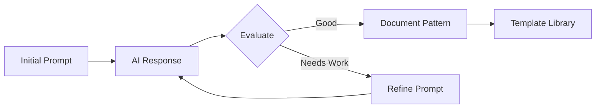

# Chapter 5: Prompt Design and Optimization

## Overview

This chapter covers techniques for designing and optimizing prompts for AI-Driven Test-Driven Development. Effective prompt engineering is crucial for maximizing the productivity and quality of AI-assisted development.

## Key Principles

### 1. Clarity and Specificity

- **Be Explicit**: Clearly state the expected behavior, input/output formats, and constraints
- **Avoid Ambiguity**: Use precise technical terminology and avoid vague descriptions
- **Provide Context**: Include relevant background information about the system architecture

### 2. Structured Format

Use consistent formatting for prompts:

```markdown
## Task
[Clear description of what needs to be implemented]

## Requirements
- Requirement 1: [Specific detail]
- Requirement 2: [Specific detail]

## Constraints
- [Technical constraints]
- [Performance requirements]

## Expected Output
[Description of expected results]
```

### 3. Example-Driven Approach

Include concrete examples in prompts:

```typescript
// Example: Input validation
// Good prompt:
"Implement a function that validates email addresses.
Examples:
- 'user@example.com' → true
- 'invalid.email' → false
- '@example.com' → false"
```

## Optimization Strategies

### 1. Iterative Refinement

1. Start with a basic prompt
2. Analyze the AI's response
3. Identify gaps or misunderstandings
4. Refine the prompt with additional clarification
5. Repeat until desired output is achieved

### 2. Context Window Management

- Keep prompts concise but complete
- Remove unnecessary information
- Use references to external documentation when appropriate
- Break complex tasks into smaller, focused prompts

### 3. Template Libraries

Create reusable prompt templates for common patterns:

```yaml
templates:
  api_endpoint:
    prompt: |
      Create a REST API endpoint for {resource}
      Method: {method}
      Path: {path}
      Request Body: {request_schema}
      Response: {response_schema}
      Validation: {validation_rules}
  
  test_case:
    prompt: |
      Write a test for {function_name}
      Scenario: {scenario}
      Input: {input}
      Expected Output: {output}
      Edge Cases: {edge_cases}
```

## Measuring Effectiveness

### Quality Metrics

1. **Accuracy Rate**: Percentage of correct implementations on first attempt
2. **Iteration Count**: Number of prompt refinements needed
3. **Time to Solution**: Total time from initial prompt to working solution
4. **Code Quality**: Adherence to coding standards and best practices

### Feedback Loop



## Best Practices

1. **Version Control Prompts**: Track prompt evolution and effectiveness
2. **Share Successful Patterns**: Build a team knowledge base
3. **Regular Reviews**: Periodically review and update prompt templates
4. **A/B Testing**: Compare different prompt strategies
5. **Documentation**: Document what works and what doesn't

## Common Pitfalls

- **Over-specification**: Too much detail can constrain creativity
- **Under-specification**: Too little detail leads to incorrect assumptions
- **Inconsistent Terminology**: Using different terms for the same concept
- **Missing Edge Cases**: Forgetting to specify error handling
- **Assumed Knowledge**: Assuming the AI knows project-specific conventions

## Conclusion

Effective prompt design is a skill that improves with practice. By following these principles and continuously refining your approach, you can significantly enhance the quality and efficiency of AI-assisted development.