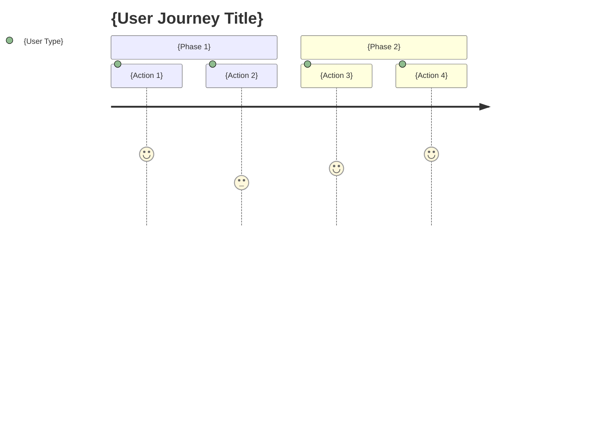

# kairo-requirements

## Purpose

Analyze user-provided requirement summaries and create detailed requirement definition documents with acceptance criteria using EARS (Easy Approach to Requirements Syntax) notation.

## Prerequisites

- Requirement summary is provided by the user
- `docs/spec/` directory exists (create if not present)

## Execution Details

**【Reliability Level Instructions】**:
For each item, comment on the verification status with original documents (EARS requirement definitions and design documents) using the following signals:

- 🟢 **Green**: When hardly any speculation is made based on original documents
- 🟡 **Yellow**: When reasonable speculation is made from original documents
- 🔴 **Red**: When speculation is not found in original documents

1. **Requirement Analysis**
   - Understand the requirement summary provided by the user
   - Apply relevant domain knowledge
   - Supplement unclear points based on general best practices

2. **User Story Creation**
   - Describe in WHO (who), WHAT (what), WHY (why) format
   - Clarify the value of each feature

3. **Requirement Definition using EARS Notation**
   - **Normal Requirements (SHALL)**: Actions the system should normally perform
   - **Conditional Requirements (WHEN/IF-THEN)**: Actions under specific conditions
   - **State Requirements (WHERE)**: Actions in specific states
   - **Optional Requirements (MAY)**: Optional features
   - **Constraint Requirements (MUST)**: System constraints

4. **Edge Case Definition**
   - Exception handling
   - Boundary value handling
   - Error handling
   - Performance requirements

5. **File Creation**
   - `docs/spec/{requirement-name}-requirements.md`: Functional requirements and links to related documents
   - `docs/spec/{requirement-name}-user-stories.md`: Detailed user stories
   - `docs/spec/{requirement-name}-acceptance-criteria.md`: Acceptance criteria and test items
   - Create structured documents in Markdown format

## Output Format Examples

### 1. requirements.md (Main File)

```markdown
# {Requirement Name} Requirement Definition Document

## Overview

{Requirement overview}

## Related Documents

- **User Stories**: [📖 {requirement-name}-user-stories.md]({requirement-name}-user-stories.md)
- **Acceptance Criteria**: [✅ {requirement-name}-acceptance-criteria.md]({requirement-name}-acceptance-criteria.md)

## Functional Requirements (EARS Notation)

### Normal Requirements

- REQ-001: The system shall {normal action}
- REQ-002: The system shall {normal action}

### Conditional Requirements

- REQ-101: When {condition}, the system shall {action}
- REQ-102: When {condition}, the system shall {action}

### State Requirements

- REQ-201: When in {state}, the system shall {action}

### Optional Requirements

- REQ-301: The system may {optional feature}

### Constraint Requirements

- REQ-401: The system must {constraint}

## Non-Functional Requirements

### Performance

- NFR-001: {Performance requirement}

### Security

- NFR-101: {Security requirement}

### Usability

- NFR-201: {Usability requirement}

## Edge Cases

### Error Handling

- EDGE-001: {Error case}

### Boundary Values

- EDGE-101: {Boundary value case}
```

### 2. user-stories.md (Detailed User Stories)

```markdown
# {Requirement Name} User Stories

## Overview

This document describes detailed user stories for the {requirement name} feature.

## User Type Definitions

### Primary Users

- **End Users**: {Detailed description of end users}
- **Administrators**: {Detailed description of administrators}
- **Developers**: {Detailed description of developers}

### Secondary Users

- **System Administrators**: {Detailed description of system administrators}
- **External Systems**: {Detailed description of external systems}

## User Stories

### 📚 Epic 1: {Large Feature Group}

#### Story 1.1: {Specific Story Name}

**User Story**:
- **As a** {user type}
- **In** {specific situation/context}
- **I want to** {desired action/operation}
- **So that** {value gained/problem solved}

**Detailed Description**:
- **Background**: {Why this feature is needed}
- **Prerequisites**: {Preconditions for this story}
- **Usage Scenarios**: {Examples of specific usage scenarios}
- **Expected Experience**: {Details of expected user experience}

**Related Requirements**: REQ-001, REQ-002

**Priority**: High/Medium/Low

**Estimate**: {Story points or effort}

#### Story 1.2: {Specific Story Name}

{Same format as above}

### 📚 Epic 2: {Large Feature Group}

{Same format as above}

## User Journeys

### Journey 1: {Representative Usage Flow}



**Details**:
1. **{Action 1}**: {Detailed description}
2. **{Action 2}**: {Detailed description}

## Persona Definitions

### Persona 1: {Representative User Name}

- **Basic Information**: {Age, occupation, technical level, etc.}
- **Goals**: {What this user wants to achieve}
- **Challenges**: {Current problems they face}
- **Behavior Patterns**: {Typical behavioral characteristics}
- **Usage Environment**: {Devices, environment used, etc.}

## Non-Functional User Requirements

### Usability Requirements

- **Learnability**: {Learning cost for first-time use}
- **Efficiency**: {Work efficiency after becoming proficient}
- **Memorability**: {Ease of remembering for reuse}
- **Error Recovery**: {Ease of handling errors}
- **Satisfaction**: {Subjective satisfaction}

### Accessibility Requirements

- **Visual**: {Considerations for visually impaired users}
- **Auditory**: {Considerations for hearing impaired users}
- **Motor**: {Considerations for motor impaired users}
- **Cognitive**: {Considerations for cognitively impaired users}
```

### 3. acceptance-criteria.md (Acceptance Criteria)

```markdown
# {Requirement Name} Acceptance Criteria

## Overview

This document describes acceptance criteria and test items for the {requirement name} feature.

## Functional Test Criteria

### REQ-001: {Requirement Name} Acceptance Criteria

**Given (Preconditions)**:
- {State before test execution}
- {Required initial data}

**When (Execution Conditions)**:
- {Action to execute}
- {Data to input}

**Then (Expected Results)**:
- {Expected output/state}
- {Side effects to verify}

**Test Cases**:
- [ ] Normal case: {Normal case details}
- [ ] Exception case: {Exception case details}
- [ ] Boundary value: {Boundary value test details}

### REQ-002: {Requirement Name} Acceptance Criteria

{Same format as above}

## Non-Functional Test Criteria

### Performance Testing

**NFR-001: {Performance Requirement}**

- [ ] Response time: {Specific time criteria}
- [ ] Throughput: {Processing volume criteria}
- [ ] Concurrent connections: {Concurrent user criteria}
- [ ] Resource usage: {CPU/memory usage criteria}

**Test Method**:
- Load testing tool: {Tool to use}
- Test scenario: {Specific test procedures}
- Pass criteria: {Quantitative pass line}

### Security Testing

**NFR-101: {Security Requirement}**

- [ ] Authentication: {Authentication feature test items}
- [ ] Authorization: {Access control test items}
- [ ] Data protection: {Data encryption test items}
- [ ] Vulnerabilities: {Security vulnerability test items}

## Usability Test Criteria

### UX/UI Testing

- [ ] Intuitive operation: {Ease of understanding operations}
- [ ] Responsive design: {Display on each device}
- [ ] Accessibility: {WCAG 2.1 compliance}
- [ ] Error messages: {Clear error display}

**Test Method**:
- Usability testing: {Implementation method}
- A/B testing: {Comparison test method}
- Accessibility check: {Tools to use}

## Edge Case Test Criteria

### EDGE-001: {Error Case} Acceptance Criteria

**Test Scenario**:
- {Setting up abnormal situation}
- {Expected error handling}
- {Appropriate notification to user}

**Pass Criteria**:
- [ ] System does not crash
- [ ] Appropriate error message is displayed
- [ ] Data consistency is maintained
- [ ] Recoverable state is maintained

## Integration Test Criteria

### Inter-System Integration Testing

- [ ] External API integration: {Integration test with external systems}
- [ ] Database integration: {DB operation consistency test}
- [ ] File system: {File operation test}

## Regression Test Criteria

### Existing Feature Impact Verification

- [ ] Existing feature operation verification: {Impact range identification and verification}
- [ ] Performance degradation verification: {Performance verification of existing features}
- [ ] Security configuration verification: {Continued verification of security features}

## Acceptance Test Execution Checklist

### Pre-Test Execution

- [ ] Test environment preparation completed
- [ ] Test data preparation completed
- [ ] Test tools preparation completed
- [ ] Executor confirmation completed

### During Test Execution

- [ ] All functional tests executed
- [ ] All non-functional tests executed
- [ ] Problem recording during discovery
- [ ] Retest after fixes

### Post-Test Completion

- [ ] Test results recorded
- [ ] Remaining issues organized
- [ ] Acceptance decision made
- [ ] Stakeholder reporting
```

## Post-Execution Verification

- Display paths of the created three files
  - `docs/spec/{requirement-name}-requirements.md`
  - `docs/spec/{requirement-name}-user-stories.md`
  - `docs/spec/{requirement-name}-acceptance-criteria.md`
- Report number of main requirements and user stories
- Verify that links within each file are set correctly
- Display message prompting user confirmation