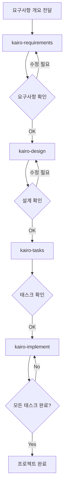

# Tsumiki 매뉴얼

## 사용법

### 설정

프로젝트를 사용하기 전에 먼저 `commands` 디렉토리의 내용을 Claude의 명령 디렉토리에 복사합니다:

```bash
# 프로젝트의 commands 디렉토리를 .claude/commands에 복사
cp -r commands ~/.claude/commands/

# 또는 프로젝트 디렉토리 내에서
mkdir -p .claude
cp -r commands .claude/
```

### TDD 명령어

TASK 생성 시 `TDD`로 판정되고 개별적으로 TDD 프로세스를 실행하고 싶은 경우, 다음 명령어를 순차적으로 실행할 수 있습니다:

```
# TDD 요구사항 정의
/tdd-requirements 태스크파일명 TASK번호

# 테스트 케이스 생성
/tdd-testcases 태스크파일명 TASK번호

# 테스트 구현부터 TDD 완료 확인까지 자동화
/tdd-cycle-full.sh "태스크파일명 TASK번호"

# 테스트 구현 (Red)
/tdd-red 태스크파일명 TASK번호

# 최소 구현 (Green)
/tdd-green 태스크파일명 TASK번호

# 리팩토링
/tdd-refactor 태스크파일명 TASK번호

# TDD 완료 확인
/tdd-verify-complete 태스크파일명 TASK번호
```

### DIRECT 명령어

TASK 생성 시 `DIRECT`로 판정된 경우, 다음 명령어를 순차적으로 실행할 수 있습니다:

```
# DIRECT 준비
/direct-setup 태스크파일명 TASK번호

# DIRECT 검증
/direct-verify 태스크파일명 TASK번호
```

### Kairo 명령어 (포괄적 플로우)

#### 1. 요구사항 정의

먼저 프로젝트의 요구사항 개요를 Kairo에 전달합니다:

```
/kairo-requirements 요구사항개요

# 프롬프트 예시:
# "EC사이트의 상품 리뷰 기능을 구현하고 싶습니다.
#  사용자는 상품에 대해 5단계 평가와 코멘트를 게시할 수 있고,
#  다른 사용자의 리뷰를 참조할 수 있습니다."
```

Kairo는 다음을 생성합니다:
- 사용자 스토리
- EARS 기법을 사용한 상세한 요구사항 정의
- 엣지 케이스 고려사항
- 수락 기준

생성된 파일: `/docs/spec/{요구사항명}-requirements.md`

#### 2. 설계

요구사항을 확인·수정한 후, 설계를 요청합니다:

```
/kairo-design (또는 생략 가능)

# 요구사항이 승인되었음을 알려주세요
```

Kairo는 다음을 생성합니다:
- 아키텍처 설계서
- 데이터 플로우 다이어그램 (Mermaid)
- TypeScript 인터페이스 정의
- 데이터베이스 스키마
- API 엔드포인트 사양

생성된 파일: `/docs/design/{요구사항명}/` 하위

#### 3. 태스크 분할

설계를 확인한 후 (승인은 생략 가능), 태스크 분할을 실행합니다:

```
/kairo-tasks

# 설계가 승인되었음을 알려주세요 (또는 생략 가능)
```

태스크 내용 확인을 위해 `/kairo-task-verify`를 실행하는 것을 권장합니다.

Kairo는 다음을 생성합니다:
- 의존성을 고려한 태스크 목록
- 각 태스크의 세부사항 (테스트 요구사항, UI/UX 요구사항 포함)
- 실행 순서와 스케줄

생성된 파일: `/docs/tasks/{요구사항명}-tasks.md`

#### 4. 구현

태스크를 확인한 후, 구현을 시작합니다:
(TDD 사이클 또는 DIRECT 수동 실행을 권장합니다)

```
# 모든 태스크를 순서대로 구현
/kairo-implement

# 특정 태스크만 구현
/kairo-implement 태스크파일명 TASK번호
# "TASK-101을 구현해주세요"
```

Kairo는 각 태스크에 대해 내부적으로 TDD 명령어를 사용하여 다음 프로세스를 실행합니다:
1. TDD 요구사항 정의 (tdd-requirements)
2. 테스트 케이스 생성 (tdd-testcases)
3. 테스트 구현 (tdd-red)
4. 최소 구현 (tdd-green)
5. 리팩토링 (tdd-refactor)
6. TDD 완료 확인 (tdd-verify-complete)

### 리버스 엔지니어링 명령어

기존 코드베이스에서 각종 문서를 역생성하는 경우, 다음 명령어를 순차적으로 실행할 수 있습니다:

```
# 기존 코드에서 태스크 구조 분석
/rev-tasks

# 설계 문서의 역생성 (태스크 분석 후 권장)
/rev-design

# 테스트 사양서의 역생성 (설계 문서 후 권장)
/rev-specs

# 요구사항 정의서의 역생성 (전체 분석 완료 후 권장)
/rev-requirements
```

#### 리버스 엔지니어링 세부사항

##### 개요

리버스 엔지니어링 명령어는 기존 코드베이스를 분석하고, 구현에서 역산하여 각종 문서를 생성합니다.

##### 권장 실행 순서

1. **rev-tasks** - 코드베이스 전체를 분석하여 태스크 구조 파악
2. **rev-design** - 아키텍처와 설계 문서 생성
3. **rev-specs** - 테스트 사양서와 테스트 케이스 생성
4. **rev-requirements** - 요구사항 정의서를 최종적으로 생성

##### 각 명령어의 세부사항

###### rev-tasks (태스크 구조 분석)

**목적**: 기존 코드에서 구현된 기능을 태스크로 추출·정리

**생성되는 파일**:
- `docs/reverse/{프로젝트명}-discovered-tasks.md`

**분석 내용**:
- 코드베이스 구조 파악
- 구현된 기능 특정
- API 엔드포인트 추출
- 데이터베이스 구조 분석
- 태스크 의존성 추정

###### rev-design (설계 문서 역생성)

**목적**: 구현된 아키텍처에서 기술 설계 문서 생성

**생성되는 파일**:
- `docs/reverse/{프로젝트명}-architecture.md`
- `docs/reverse/{프로젝트명}-dataflow.md`
- `docs/reverse/{프로젝트명}-api-specs.md`
- `docs/reverse/{프로젝트명}-database.md`
- `docs/reverse/{프로젝트명}-interfaces.ts`

**분석 내용**:
- 아키텍처 패턴 특정
- 데이터 플로우 추출
- API 사양 추출
- 데이터베이스 스키마 역생성
- TypeScript 타입 정의 정리

###### rev-specs (테스트 사양서 역생성)

**목적**: 구현 코드에서 테스트 케이스와 사양서를 역생성

**생성되는 파일**:
- `docs/reverse/{프로젝트명}-test-specs.md`
- `docs/reverse/{프로젝트명}-test-cases.md`
- `docs/reverse/tests/` - 생성된 테스트 코드

**분석 내용**:
- 기존 테스트 분석
- 부족한 테스트 케이스 특정
- API 테스트 케이스 생성
- UI 컴포넌트 테스트 생성
- 성능·보안 테스트 제안

###### rev-requirements (요구사항 정의서 역생성)

**목적**: 구현 기능에서 요구사항 정의서를 EARS 기법으로 역생성

**생성되는 파일**:
- `docs/reverse/{프로젝트명}-requirements.md`

**분석 내용**:
- 사용자 스토리의 역산
- EARS 기법을 통한 요구사항 분류
- 비기능 요구사항 추정
- 엣지 케이스 특정
- 수락 기준 생성

##### 사용 예시

```bash
# 프로젝트 전체의 역해석
/rev-tasks
# → 태스크 구조 파악

/rev-design
# → 아키텍처와 설계를 문서화

/rev-specs
# → 테스트 상황을 분석하여 부족한 테스트 특정

/rev-requirements
# → 최종적으로 요구사항 정의서 생성
```

##### 주의사항

- 각 단계에서 생성된 내용은 반드시 검토하세요
- 추정된 요구사항은 실제 비즈니스 요구사항과 다를 수 있습니다
- 테스트 케이스는 구현 상황에서 추정되므로 완전하지 않을 수 있습니다

## 디렉토리 구조

```
/projects/ai/test18/
├── .claude/
│   └── commands/           # Kairo 명령어
├── docs/
│   ├── spec/              # 요구사항 정의서
│   ├── design/            # 설계 문서
│   ├── tasks/             # 태스크 목록
│   └── reverse/           # 리버스 문서
├── implementation/        # 구현 코드
│   └── {요구사항명}/
│       └── {태스크ID}/
├── backend/              # 백엔드 코드
├── frontend/             # 프론트엔드 코드
└── database/             # 데이터베이스 관련
```

## 워크플로우 예시



## 장점

1. **일관된 개발 프로세스**
   - 요구사항부터 구현까지 통합된 플로우
   - EARS 기법을 통한 명확한 요구사항 정의

2. **품질 보장**
   - TDD 명령어를 통한 견고한 구현
   - 포괄적인 테스트 커버리지

3. **효율적인 개발**
   - 자동적인 태스크 분할과 우선순위 설정
   - 의존성 가시화

4. **포괄적인 문서화**
   - 요구사항, 설계, 구현이 모두 문서화
   - 나중에 참조하기 용이

## 주의사항

- 각 단계에서 사용자 확인을 요청합니다
- 생성된 내용은 반드시 검토하세요
- 프로젝트 특성에 따라 조정이 필요할 수 있습니다

## 문제 해결

### Q: 요구사항이 너무 복잡한 경우는?
A: 요구사항을 여러 개의 작은 기능으로 분할하여 각각에 대해 Kairo를 실행하세요.

### Q: 기존 코드베이스에 적용할 수 있나요?
A: 네. 기존 코드를 분석한 후 새 기능 추가나 수정에 사용할 수 있습니다.

### Q: 커스터마이징이 가능한가요?
A: 네. 각 명령어 파일을 편집하여 프로젝트에 맞는 커스터마이징이 가능합니다.

## 지원

문제나 질문이 있는 경우, 프로젝트의 이슈 트래커에 보고해주세요.