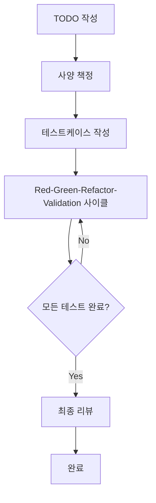

# 3.1 확장 TDD 프로세스의 전체 플로우

## AITDD 프로세스 개요

AITDD는 기존 TDD(Test-Driven Development)에 AI의 힘을 결합하여 **Validation** 단계를 추가한 확장 개발 방법론입니다. 인간과 AI가 협력함으로써 고품질 소프트웨어를 효율적으로 개발할 수 있습니다.

## 전체 플로우 구조



### 기본적인 프로세스 플로우

```
TODO 작성 → 사양 책정 → 테스트케이스 작성 → Red-Green-Refactor-Validation → 최종 리뷰
```

## 각 단계의 상세

### 1. TODO 작성 (인간 담당)

**목적**: 개발 작업을 명확히 정의하고 적절한 작업 단위로 분할

**작업 내용**:
- 기능 요구사항 도출
- 개발 작업 세분화
- 우선순위 설정
- 작업 범위 명확화

**성과물**: TODO.md 파일
- 구체적이고 구현 가능한 단위의 작업 목록
- 각 작업의 우선순위와 의존관계
- 완료 조건 정의

### 2. 사양 책정 (인간 담당, 리뷰 필수)

**목적**: TODO로부터 상세한 기술 사양을 책정

**작업 내용**:
- 기능의 상세 사양 정의
- 입출력 명확화
- 에러 핸들링 방침 책정
- 성능 요구사항 설정

**중요 포인트**:
- **인간의 리뷰가 필수**
- AI의 제안을 참고하면서 최종 판단은 인간이 실행
- 사양의 모호함 배제

**성과물**: requirements.md 파일
- 기능 요구사항 상세
- 기술적 제약
- 품질 요구사항

### 3. 테스트케이스 작성 (인간 담당, 리뷰 필수)

**목적**: 사양에 기반하여 포괄적인 테스트케이스 설계

**작업 내용**:
- 정상 경로 테스트케이스 설계
- 비정상 경로 테스트케이스 설계
- 경계값 테스트 계획
- 엣지케이스 특정

**중요 포인트**:
- **인간의 리뷰가 필수**
- 테스트케이스의 망라성 확보
- 사양과의 정합성 검증

**성과물**: testcases.md 파일
- 테스트케이스 목록
- 기대하는 동작의 상세
- 테스트 데이터 정의

### 4. Red-Green-Refactor-Validation 사이클 (주로 AI 담당)

기존 TDD 사이클을 확장하여 **Validation** 단계를 추가했습니다. 이 사이클은 거의 모든 것을 AI가 실행하지만 인간의 감독하에 이루어집니다.

#### Red (테스트 실패)
- 테스트케이스 구현
- 기대하는 실패 확인
- 테스트 실행과 실패 확인

#### Green (최소 구현)
- 테스트를 통과하는 최소한의 구현
- AI에 의한 자동 코드 생성
- 테스트 성공 확인

#### Refactor (리팩토링)
- 코드 품질 개선
- AI에 의한 최적화
- 가독성과 유지보수성 향상

#### Validation (검증)
- 구현의 타당성 검증
- 품질 체크
- 추가적인 검증 항목 확인

### 5. 최종 리뷰 (인간 담당)

**목적**: 생성된 코드 전체의 품질과 사양 적합성을 최종 확인

**작업 내용**:
- 소스코드 상세 리뷰
- 사양과의 정합성 확인
- 보안 체크
- 성능 검증

**중요 포인트**:
- **반드시 인간이 실시**
- AI가 생성한 코드의 최종 품질 보증
- 프로덕션 투입 전 최후의 보루

## AI와 인간의 역할 분담

### AI (Claude 등)가 담당하는 영역

- **Red-Green-Refactor-Validation 사이클 실행**
  - 테스트케이스 구현
  - 프로덕션 코드 생성
  - 리팩토링 실행
  - 품질 검증 지원

- **코드 생성과 최적화**
  - 효율적인 알고리즘 구현
  - 코딩 규약에 따른 구현
  - 자동적인 코드 개선

- **자동 테스트 실행**
  - 테스트 실행과 결과 확인
  - 테스트 커버리지 측정
  - 계속적인 품질 체크

### 인간이 담당하는 영역

- **전략적 판단**
  - 사양 책정과 리뷰
  - 테스트케이스 설계와 리뷰
  - 아키텍처 결정

- **품질 관리**
  - 최종적인 소스코드 리뷰
  - 보안 요구사항 확인
  - 비즈니스 요구사항과의 적합성 확인

- **창조적 작업**
  - 문제 해결 방법 결정
  - 사용자 경험 설계
  - 기술 선택 판단

## 기존 TDD와의 비교

| 항목 | 기존 TDD | AITDD |
|------|---------|--------|
| **사이클** | Red-Green-Refactor | Red-Green-Refactor-**Validation** |
| **구현 주체** | 인간 | **AI** (인간 감독하) |
| **리뷰** | 구현 후에만 | **사양・테스트・최종 코드** |
| **속도** | 인간의 구현 속도에 의존 | **AI 지원으로 대폭 고속화** |
| **품질 관리** | 개발자 스킬에 의존 | **다층적인 품질 체크** |
| **학습 비용** | TDD 습득이 필요 | **TDD + AI 활용 스킬** |

## 프로세스의 이점

### 1. 개발 속도 향상
- AI에 의한 자동 코드 생성으로 구현 시간 대폭 단축
- 반복적인 작업의 자동화
- 테스트 실행과 피드백 고속화

### 2. 품질 향상
- Validation 단계에 의한 추가적인 품질 체크
- 인간과 AI의 이중 체크 체제
- 일관된 품질 기준 적용

### 3. 지식 활용
- AI에 의한 최신 기술과 모범 사례 활용
- 경험이 적은 개발자도 고품질 코드 생성
- 도메인 지식의 자동적인 활용

### 4. 지속적 개선
- AI 피드백에 의한 학습 효과
- 프로세스 자체의 지속적 최적화
- 팀 전체의 스킬 향상

## 주의사항과 리스크 관리

### 1. 과도한 AI 의존 회피
- 중요한 판단은 반드시 인간이 실시
- AI 제안을 맹목적으로 받아들이지 않음
- 기술적 이해를 지속적으로 깊게 함

### 2. 품질 관리 강화
- 복수 단계에서의 리뷰 실시
- 자동 테스트와 매뉴얼 테스트 병용
- 보안 요구사항의 확실한 확인

### 3. 프로세스의 유연성
- 프로젝트에 따른 프로세스 조정
- 팀의 스킬 레벨에 따른 적용
- 지속적인 프로세스 개선

## 다음 단계

3장에서는 이 프로세스의 각 단계를 상세하게 해설해 나갑니다:

- [3.2 TODO 작성과 사양 책정](./02-todo-and-specification.md)
- [3.3 테스트케이스 작성](./03-test-case-creation.md)
- [3.4 Red-Green-Refactor-Validation 사이클](./04-rgr-validation-cycle.md)
- [3.5 Validation 단계의 상세](./05-validation-details.md)

각 단계에서 구체적인 절차와 기법을 배워 실제로 AITDD를 실천할 수 있게 됩시다.