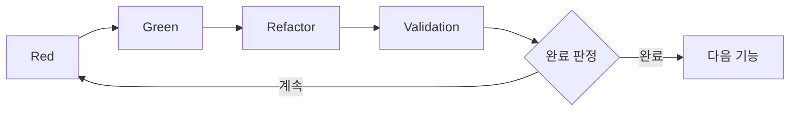

# 3.4 Red-Green-Refactor-Validation 사이클

## 확장 TDD 사이클 개요

AITDD의 핵심은 기존 TDD(Red-Green-Refactor)에 **Validation** 단계를 추가한 확장 사이클입니다. 이 사이클은 주로 AI가 실행하지만 인간의 감독 하에 진행되며, 고품질 코드를 효율적으로 생성합니다.



## Red-Green-Refactor-Validation 사이클 상세

### Red 페이즈: 테스트 실패 확인

#### 목적
- 테스트 케이스를 구현한다
- 테스트가 예상대로 실패함을 확인한다
- 테스트 자체의 정당성을 검증한다

#### 구체적인 작업 내용

##### 1. 테스트 케이스 구현
```javascript
// 예: 사용자 등록 기능 테스트 구현
describe('User Registration', () => {
  test('should create user with valid data', async () => {
    const userData = {
      email: 'test@example.com',
      password: 'SecurePass123!',
      password_confirmation: 'SecurePass123!'
    };
    
    const response = await request(app)
      .post('/api/users')
      .send(userData);
    
    expect(response.status).toBe(201);
    expect(response.body).toHaveProperty('id');
    expect(response.body.email).toBe(userData.email);
    
    // 데이터베이스 확인
    const user = await User.findByEmail(userData.email);
    expect(user).toBeTruthy();
    expect(user.password_hash).not.toBe(userData.password);
  });
  
  test('should reject duplicate email', async () => {
    // 기존 사용자를 사전 생성
    await createUser({ email: 'existing@example.com' });
    
    const duplicateData = {
      email: 'existing@example.com',
      password: 'NewPass456!'
    };
    
    const response = await request(app)
      .post('/api/users')
      .send(duplicateData);
    
    expect(response.status).toBe(400);
    expect(response.body.error).toBe('validation_failed');
    expect(response.body.details[0].field).toBe('email');
  });
});
```

##### 2. 테스트 실행과 실패 확인
```bash
$ npm test
❌ User Registration › should create user with valid data
   Error: Cannot POST /api/users
   
❌ User Registration › should reject duplicate email
   Error: Cannot POST /api/users
```

##### 3. 실패 이유 확인
- 엔드포인트가 미구현
- 필요한 의존성 부족
- 테스트 환경 설정 불비

#### AI에 의한 Red 페이즈 실행

##### 프롬프트 예시
```markdown
## 지시: Red 페이즈 실행

### 배경
- 기능: 사용자 등록 API
- 테스트 케이스 사양: testcases.md 참조
- 기존 코드: src/ 하위 확인

### 실행 내용
1. testcases.md의 각 테스트 케이스를 Jest 테스트로 구현
2. 테스트를 실행하여 예상대로 실패함을 확인
3. 실패 이유를 정리하여 보고

### 출력 형식
- 테스트 코드 (완전판)
- 테스트 실행 결과
- 실패 이유 분석
- 다음 Green 페이즈로의 제안
```

### Green 페이즈: 최소 구현

#### 목적
- 테스트를 통과하는 최소한의 구현을 한다
- 과도한 구현을 피하고 테스트 주도를 유지한다
- 다음 Refactor 페이즈에서의 개선 여지를 남긴다

#### 구체적인 작업 내용

##### 1. 최소한의 API 구현
```javascript
// routes/users.js
const express = require('express');
const bcrypt = require('bcrypt');
const User = require('../models/User');
const router = express.Router();

router.post('/users', async (req, res) => {
  try {
    const { email, password, password_confirmation } = req.body;
    
    // 기본 검증
    if (!email || !password || !password_confirmation) {
      return res.status(400).json({
        error: 'validation_failed',
        details: [{ field: 'required', message: 'Missing required fields' }]
      });
    }
    
    if (password !== password_confirmation) {
      return res.status(400).json({
        error: 'validation_failed',
        details: [{ field: 'password', message: 'Password confirmation does not match' }]
      });
    }
    
    // 중복 체크
    const existingUser = await User.findByEmail(email);
    if (existingUser) {
      return res.status(400).json({
        error: 'validation_failed',
        details: [{ field: 'email', message: 'Email already exists' }]
      });
    }
    
    // 패스워드 해시화
    const password_hash = await bcrypt.hash(password, 10);
    
    // 사용자 생성
    const user = await User.create({
      email,
      password_hash
    });
    
    res.status(201).json({
      id: user.id,
      email: user.email,
      created_at: user.created_at
    });
    
  } catch (error) {
    console.error('User creation error:', error);
    res.status(500).json({ error: 'Internal server error' });
  }
});

module.exports = router;
```

##### 2. 필요 최소한의 모델 구현
```javascript
// models/User.js
const db = require('../database');

class User {
  static async findByEmail(email) {
    const result = await db.query(
      'SELECT * FROM users WHERE email = ?',
      [email]
    );
    return result[0] || null;
  }
  
  static async create({ email, password_hash }) {
    const result = await db.query(
      'INSERT INTO users (email, password_hash, created_at) VALUES (?, ?, NOW())',
      [email, password_hash]
    );
    
    return {
      id: result.insertId,
      email,
      created_at: new Date()
    };
  }
}

module.exports = User;
```

##### 3. 테스트 실행과 성공 확인
```bash
$ npm test
✅ User Registration › should create user with valid data
✅ User Registration › should reject duplicate email

Tests: 2 passed, 2 total
```

#### AI에 의한 Green 페이즈 실행

##### 프롬프트 예시
```markdown
## 지시: Green 페이즈 실행

### 배경
- 실패 중인 테스트: [Red 페이즈 결과]
- 요구사항: requirements.md 참조
- 기존 코드 구조: src/ 하위 확인

### 실행 내용
1. 실패 테스트를 통과하는 최소한의 구현
2. 요구사항의 과도한 구현은 피함
3. 테스트 실행으로 전체 케이스 성공 확인

### 제약
- 최소 구현 원칙을 준수
- 테스트 케이스 이외의 기능은 구현하지 않음
- 기존 코드와의 정합성 유지

### 출력 형식
- 구현 코드 (완전판)
- 테스트 실행 결과
- 구현 방침 설명
```

### Refactor 페이즈: 코드 개선

#### 목적
- 코드의 품질을 향상시킨다
- 보수성과 가독성을 개선한다
- 성능을 최적화한다
- 테스트는 계속해서 성공시킨다

#### 구체적인 작업 내용

##### 1. 코드 구조 개선
```javascript
// services/UserService.js - 비즈니스 로직의 분리
class UserService {
  constructor(userRepository, passwordHasher) {
    this.userRepository = userRepository;
    this.passwordHasher = passwordHasher;
  }
  
  async createUser({ email, password, password_confirmation }) {
    // 검증
    this.validateUserInput({ email, password, password_confirmation });
    
    // 중복 체크
    await this.checkEmailUniqueness(email);
    
    // 사용자 생성
    const password_hash = await this.passwordHasher.hash(password);
    return await this.userRepository.create({ email, password_hash });
  }
  
  validateUserInput({ email, password, password_confirmation }) {
    const errors = [];
    
    if (!this.isValidEmail(email)) {
      errors.push({ field: 'email', message: 'Invalid email format' });
    }
    
    if (!this.isValidPassword(password)) {
      errors.push({ field: 'password', message: 'Password does not meet requirements' });
    }
    
    if (password !== password_confirmation) {
      errors.push({ field: 'password_confirmation', message: 'Password confirmation does not match' });
    }
    
    if (errors.length > 0) {
      throw new ValidationError(errors);
    }
  }
  
  async checkEmailUniqueness(email) {
    const existingUser = await this.userRepository.findByEmail(email);
    if (existingUser) {
      throw new ValidationError([{ field: 'email', message: 'Email already exists' }]);
    }
  }
  
  isValidEmail(email) {
    const emailRegex = /^[^\s@]+@[^\s@]+\.[^\s@]+$/;
    return email && email.length <= 254 && emailRegex.test(email);
  }
  
  isValidPassword(password) {
    if (!password || password.length < 8) return false;
    
    const hasUpperCase = /[A-Z]/.test(password);
    const hasLowerCase = /[a-z]/.test(password);
    const hasNumbers = /\d/.test(password);
    const hasSymbols = /[!@#$%^&*()_+\-=\[\]{};':"\\|,.<>\/?]/.test(password);
    
    return hasUpperCase && hasLowerCase && hasNumbers && hasSymbols;
  }
}

// 컨트롤러의 간소화
router.post('/users', async (req, res) => {
  try {
    const user = await userService.createUser(req.body);
    res.status(201).json({
      id: user.id,
      email: user.email,
      created_at: user.created_at
    });
  } catch (error) {
    if (error instanceof ValidationError) {
      return res.status(400).json({
        error: 'validation_failed',
        details: error.details
      });
    }
    
    console.error('User creation error:', error);
    res.status(500).json({ error: 'Internal server error' });
  }
});
```

##### 2. 오류 처리 개선
```javascript
// errors/ValidationError.js
class ValidationError extends Error {
  constructor(details) {
    super('Validation failed');
    this.name = 'ValidationError';
    this.details = details;
  }
}

// middlewares/errorHandler.js
const errorHandler = (error, req, res, next) => {
  if (error instanceof ValidationError) {
    return res.status(400).json({
      error: 'validation_failed',
      details: error.details
    });
  }
  
  console.error('Unhandled error:', error);
  res.status(500).json({ error: 'Internal server error' });
};
```

##### 3. 테스트 실행으로 품질 유지 확인
```bash
$ npm test
✅ User Registration › should create user with valid data
✅ User Registration › should reject duplicate email
✅ User Registration › should validate email format
✅ User Registration › should validate password strength

Tests: 4 passed, 4 total
```

#### AI에 의한 Refactor 페이즈 실행

##### 프롬프트 예시
```markdown
## 지시: Refactor 페이즈 실행

### 배경
- 현재 코드: [Green 페이즈 성과물]
- 테스트 상황: 전체 테스트 성공
- 품질 목표: 보수성·가독성·성능 향상

### 실행 내용
1. 코드 구조 개선 (책임 분리, DRY 원칙)
2. 오류 처리 통일
3. 성능 최적화
4. 코딩 규약 적용
5. 테스트 실행으로 품질 유지 확인

### 제약
- 기존 테스트를 파괴하지 않음
- 과도한 아키텍처 변경은 피함
- 단계적 개선을 중시

### 출력 형식
- 리팩터링 후 코드
- 개선점 설명
- 테스트 실행 결과
```

### Validation 페이즈: 포괄적 검증

#### 목적
- 구현의 타당성을 종합적으로 검증한다
- 품질 기준에의 적합을 확인한다
- 추가 테스트 케이스의 필요성을 평가한다
- 완료 판정을 한다

#### 구체적인 검증 항목

##### 1. 구현 완료 테스트 케이스 확인
```markdown
## 테스트 케이스 구현 상황 확인

### 예정 테스트 케이스 (testcases.md에서)
- [x] TC001: 정상적인 사용자 등록
- [x] TC002: 이메일 주소 중복 오류
- [x] TC003: 패스워드 불일치 오류
- [x] TC004: 무효한 이메일 주소 형식
- [x] TC005: 패스워드 강도 부족
- [x] TC006: 필수 항목 미입력
- [x] TC007: 경계값 테스트 - 이메일 주소 길이
- [ ] TC008: 속도 제한 테스트 (미구현)
- [ ] TC009: 데이터베이스 연결 오류 (미구현)
- [x] TC010: CSRF 토큰 검증

### 구현률: 80% (8/10)
```

##### 2. 기존 테스트의 회귀 확인
```bash
$ npm test
✅ User Authentication › should login with valid credentials
✅ User Authentication › should reject invalid password
✅ User Registration › should create user with valid data
✅ User Registration › should reject duplicate email
✅ Product Management › should create product
✅ Product Management › should list products

Tests: 6 passed, 6 total
Time: 2.341s
```

##### 3. 코드 품질 메트릭 확인
```bash
$ npm run quality-check
✅ ESLint: 0 errors, 0 warnings
✅ Test Coverage: 95% statements, 92% branches
✅ Code Complexity: Average 3.2 (Good)
✅ Dependency Check: No vulnerabilities found
```

##### 4. 사양 적합성 확인
```markdown
## 사양 적합성 체크

### 기능 요구사항
- [x] email/password 에 의한 신규 사용자 등록
- [x] 중복 email 의 검증
- [x] 패스워드 강도 체크
- [x] 패스워드 해시화 (bcrypt)

### 비기능 요구사항
- [x] 응답 시간: 평균 1.2초 (2초 이내)
- [ ] 동시 등록: 부하 테스트 미실시
- [x] 패스워드 해시화 필수

### API 사양
- [x] POST /api/users 엔드포인트
- [x] 기대되는 요청/응답 형식
- [x] 적절한 HTTP 상태 코드

### 데이터베이스 설계
- [x] users 테이블 설계
- [x] 적절한 인덱스
- [x] 제약의 구현
```

##### 5. 보안 요구사항 확인
```markdown
## 보안 체크

### 패스워드 관리
- [x] 패스워드 평문 저장 없음
- [x] bcrypt에 의한 해시화
- [x] 적절한 솔트 사용

### 입력 검증
- [x] SQL 인젝션 대책
- [x] XSS 대책
- [x] CSRF 토큰 검증

### 접근 제어
- [x] 적절한 HTTP 상태 코드
- [x] 오류 정보의 적절한 제한
```

#### AI에 의한 Validation 페이즈 실행

##### 프롬프트 예시
```markdown
## 지시: Validation 페이즈 실행

### 배경
- 구현 완료 코드: [Refactor 페이즈 성과물]
- 요구사항 정의: requirements.md
- 테스트 케이스: testcases.md
- 기존 시스템: 전체 코드베이스

### 검증 항목
1. testcases.md 기재의 전체 테스트 케이스 구현 상황 확인
2. 기존 테스트의 회귀 테스트 실행
3. requirements.md 요구사항의 충족 확인
4. 코드 품질 메트릭 측정
5. 보안 요구사항 확인

### 완료 판정 기준
- 계획 테스트 케이스의 90% 이상 구현
- 기존 테스트 전체 성공
- 중요 요구사항 100% 충족
- 중대한 보안 문제 없음

### 출력 형식
- 검증 결과 보고서
- 미구현 테스트 케이스 목록
- 품질 메트릭
- 완료/계속의 판정 이유
```

#### Validation 페이즈의 판정 기준

##### ✅ 완료 판정 (자동으로 다음 단계 진행)
```markdown
### 완료 조건
- 기존 테스트 상태: 모두 성공
- 테스트 케이스 구현률: 90% 이상
- 중요 요구사항 충족률: 100%
- 코드 커버리지: 80% 이상
- 보안 체크: 중대한 문제 없음
```

##### ⚠️ 계속 판정 (추가 구현 필요)
```markdown
### 계속 조건
- 기존 테스트: 실패 있음
- 테스트 케이스 구현률: 90% 미만
- 중요 요구사항: 미충족 항목 있음
- 품질 메트릭: 기준값 미달
- 보안: 중대한 문제 발견
```

## 사이클 전체 관리

### 프로세스 제어

#### 1. 사이클 실행의 자동화
```markdown
## AITDD 실행 스크립트 예

### 입력
- requirements.md
- testcases.md
- 기존 코드베이스

### 실행 플로우
1. Red: 테스트 케이스 구현·실행
2. Green: 최소 구현
3. Refactor: 코드 개선
4. Validation: 포괄적 검증
5. 판정: 완료/계속의 자동 판정

### 출력
- 구현 코드
- 테스트 결과
- 품질 보고서
- 다음 단계의 권장 사항
```

#### 2. 진척의 가시화
```markdown
## 진척 트래킹

### 테스트 케이스 진척
- 구현 완료: 8/10 (80%)
- 성공: 8/8 (100%)
- 실패: 0/8 (0%)

### 품질 메트릭
- 커버리지: 95%
- 복잡도: 3.2 (양호)
- 중복도: 2% (양호)

### 요구사항 충족도
- 기능 요구사항: 100%
- 비기능 요구사항: 80%
- 보안 요구사항: 100%
```

### 인간의 개입 포인트

#### 1. 중요한 판단이 필요한 경우
- 아키텍처의 대폭 변경
- 보안 요구사항의 해석
- 성능 요구사항의 조정
- 비즈니스 로직의 복잡한 판단

#### 2. 품질 기준의 조정
- 테스트 커버리지의 목표값
- 코드 복잡도의 허용값
- 성능 요구사항의 재검토

#### 3. 프로세스의 최적화
- 사이클 실행 시간의 개선
- AI 지시의 정확도 향상
- 자동화 범위의 확대

## 오류 대응과 디버깅

### 자주 발생하는 문제와 그 대처법

#### 1. Red 페이즈에서 테스트가 올바르게 실패하지 않음
**원인**: 테스트 케이스의 구현 실수, 환경 설정 문제
**대처**: 테스트 케이스 사양의 재확인, 환경의 초기화

#### 2. Green 페이즈에서 과도한 구현
**원인**: 최소 구현 원칙의 이해 부족
**대처**: 테스트 주도의 철저, 구현 범위의 명확화

#### 3. Refactor 페이즈에서 테스트가 파괴됨
**원인**: 리팩터링 중의 논리 변경
**대처**: 단계적 리팩터링, 지속적 테스트 실행

#### 4. Validation 페이즈에서 기준 미달
**원인**: 요구사항 이해의 부족, 품질 기준의 설정 실수
**대처**: 요구사항의 재확인, 기준값의 조정

## 다음 단계

Red-Green-Refactor-Validation 사이클의 이해가 되었다면, 다음은 [Validation 단계의 상세](./05-validation-details.md)에서 더 깊은 품질 관리 기법을 배웁니다.

### 학습 포인트
- [ ] 각 페이즈의 목적과 실행 내용을 이해했다
- [ ] AI와 인간의 역할 분담을 파악했다
- [ ] 사이클 전체의 품질 관리 기법을 습득했다
- [ ] 오류 대응의 기본 패턴을 배웠다

이 사이클을 마스터함으로써 AI의 힘을 최대한 활용하면서 고품질 소프트웨어를 효율적으로 개발할 수 있게 됩니다.