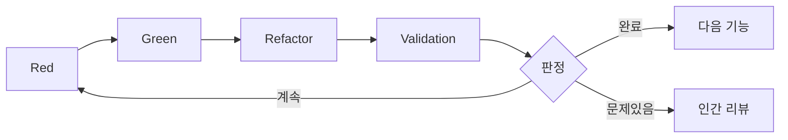

# 3.5 Validation 단계의 상세

## Validation 단계의 위치

Validation 단계는 AITDD에서 가장 중요한 혁신 중 하나입니다. 기존 TDD의 Red-Green-Refactor 사이클에 추가된 이 단계로 AI 생성 코드의 품질 보증과 완료 판정을 자동화하여, 보다 확실한 개발 프로세스를 실현합니다.

## Validation 단계의 목적

### 1. 품질 보증의 다층화
- **기능 요구사항의 충족**: 계획된 기능이 올바르게 구현되어 있음
- **회귀 방지**: 기존 기능에 악영향이 없음
- **코드 품질**: 유지보수 가능하고 고품질인 코드가 생성되어 있음

### 2. 완료 판정의 자동화
- 객관적인 기준에 의한 완료 판정
- 인간 리뷰 전의 사전 필터링
- 지속적인 품질 감시

### 3. 프로세스 개선의 피드백
- AI 생성 코드의 품질 경향 파악
- 프롬프트 개선을 위한 정보 수집
- 개발 효율의 측정과 최적화

## Validation 단계의 실행 타이밍



## 구체적인 작업 절차

### 1. 기존 테스트의 그린 상태 확인

#### 필수 조건
모든 기존 테스트가 성공하고 있는 것이 전제 조건입니다.

```bash
# 테스트 실행
$ npm test

# 기대하는 결과
✅ User Authentication › should login with valid credentials
✅ User Authentication › should reject invalid password  
✅ User Registration › should create user with valid data
✅ User Registration › should reject duplicate email
✅ Product Management › should create product
✅ Product Management › should list products

Tests: 6 passed, 6 total
Time: 2.341s
Coverage: 94%
```

#### 실패시 대응
```markdown
❌ 테스트 실패가 있는 경우의 대응

1. 실패 원인 특정
   - 신규 구현에 의한 기존 기능 영향
   - 테스트 데이터의 경합
   - 환경 의존 문제

2. 수정 실시
   - 문제가 있는 코드의 수정
   - 테스트 데이터의 조정
   - 환경 설정의 재검토

3. 재실행에 의한 확인
   - 전체 테스트의 재실행
   - 성공 확인 후 Validation 계속
```

### 2. TDD 메모 파일과 요구사항 정의 문서의 확인

#### 확인 대상 파일
```markdown
## 문서 확인 리스트

### 필수 파일
- doc/implementation/{feature_name}-requirements.md
- doc/implementation/{feature_name}-testcases.md  
- doc/todo.md

### 옵션 파일 (존재하는 경우)
- doc/implementation/{test_case_name}-memo.md
- doc/implementation/{feature_name}-architecture.md
```

#### 확인 내용 예시
```markdown
# 사용자 등록 기능 요구사항 확인

## requirements.md 에서 추출
### 예정 기능
- [x] email/password 에 의한 신규 사용자 등록
- [x] 중복 email 의 검증  
- [x] 패스워드 강도 체크
- [x] 패스워드 해시화 (bcrypt)
- [ ] 속도 제한 (100건/초) ← 미구현

### testcases.md 에서 추출  
### 예정 테스트 케이스 수: 10개
- TC001: 정상적인 사용자 등록
- TC002: 이메일 주소 중복 오류
- TC003: 패스워드 불일치 오류
- TC004: 무효한 이메일 주소 형식
- TC005: 패스워드 강도 부족
- TC006: 필수 항목 미입력
- TC007: 경계값 테스트 - 이메일 주소 길이
- TC008: 속도 제한 테스트
- TC009: 데이터베이스 연결 오류
- TC010: CSRF 토큰 검증
```

### 3. 구현 완료 테스트 케이스의 확인

#### 테스트 파일 분석
```javascript
// __tests__/user-registration.test.js 의 분석 예

describe('User Registration', () => {
  // 구현 완료 테스트 케이스의 확인
  test('TC001: should create user with valid data', async () => {
    // 구현 완료 ✅
  });
  
  test('TC002: should reject duplicate email', async () => {
    // 구현 완료 ✅
  });
  
  test('TC003: should reject password mismatch', async () => {
    // 구현 완료 ✅
  });
  
  test('TC004: should validate email format', async () => {
    // 구현 완료 ✅
  });
  
  test('TC005: should validate password strength', async () => {
    // 구현 완료 ✅
  });
  
  test('TC006: should require all fields', async () => {
    // 구현 완료 ✅
  });
  
  test('TC007: should handle email length limits', async () => {
    // 구현 완료 ✅
  });
  
  test('TC010: should verify CSRF token', async () => {
    // 구현 완료 ✅
  });
  
  // TC008, TC009 는 미구현
});
```

#### 구현 상황의 집계
```markdown
## 테스트 케이스 구현 상황

### 구현 완료: 8개
- TC001: 정상적인 사용자 등록 ✅
- TC002: 이메일 주소 중복 오류 ✅
- TC003: 패스워드 불일치 오류 ✅
- TC004: 무효한 이메일 주소 형식 ✅
- TC005: 패스워드 강도 부족 ✅
- TC006: 필수 항목 미입력 ✅
- TC007: 경계값 테스트 ✅
- TC010: CSRF 토큰 검증 ✅

### 미구현: 2개
- TC008: 속도 제한 테스트 ❌
- TC009: 데이터베이스 연결 오류 ❌

### 구현률: 80% (8/10)
```

### 4. 구현 상황의 분석과 TODO.md 업데이트 판정

#### AI 에 의한 품질 리스크 평가

```markdown
## AI 분석 리포트 예

### 구현 완료도 평가
- 기본 기능 구현률: 100%
- 테스트 케이스 구현률: 80% 
- 요구사항 충족률: 90%

### 미구현 항목의 중요도 분석
#### TC008: 속도 제한 테스트
- 중요도: 중 (보안 관련)
- 영향 범위: 프로덕션 환경에서의 악용 리스크
- 구현 우선도: 중간 정도

#### TC009: 데이터베이스 연결 오류
- 중요도: 고 (가용성 관련)
- 영향 범위: 시스템 전체의 안정성
- 구현 우선도: 높음

### 품질 리스크 평가
- 보안 리스크: 중 (속도 제한 미구현)
- 가용성 리스크: 고 (DB 장애시의 거동 불명)
- 유지보수성 리스크: 저 (코드 품질 양호)

### 권장 액션
1. TC009 (DB 연결 오류)의 우선 구현
2. TC008 (속도 제한)의 차기 구현 검토
3. 현상에서 다음 단계 진행은 가능하지만 주의 필요
```

## Validation의 판정 기준

### ✅ 완전 구현 완료 (자동으로 다음 단계)

```markdown
### 완료 조건
- 기존 테스트 상태: 모두 그린 ✅
- 테스트 케이스 구현률: 100% ✅
- 중요 기능 완성률: 100% ✅
- 품질 리스크: 없음 ✅
- 보안 체크: 합격 ✅

### 자동 판정 결과
🎉 구현 완료 - 다음 요구사항 정의 단계로 자동 진행
```

### ⚠️ 구현 부족 (추가 구현 필요)

```markdown
### 계속 조건 (예1: 중대한 미구현 있음)
- 기존 테스트 상태: 모두 그린 ✅
- 테스트 케이스 구현률: 70% ❌
- 중요 기능 완성률: 80% ❌
- 품질 리스크: 고위험 항목 있음 ❌

### 판정 결과
⚠️ 추가 구현이 필요 - Red 단계로 돌아가서 미구현 항목을 추가

### 계속 조건 (예2: 기존 테스트 실패)
- 기존 테스트 상태: 실패 있음 ❌
- 테스트 케이스 구현률: 90% ✅
- 중요 기능 완성률: 95% ✅

### 판정 결과  
❌ 회귀 테스트 실패 - Green/Refactor 단계로 돌아가서 수정
```

### 🔍 요판단 (인간 리뷰 필요)

```markdown
### 판단이 곤란한 케이스
- 테스트 케이스 구현률: 85% (경계값)
- 미구현 항목: 중요도의 판단이 곤란
- 품질 리스크: 조직 고유의 판단이 필요
- 비즈니스 요구사항: 사양의 해석에 애매함

### 판정 결과
🔍 인간 리뷰 요청 - 전문 지식에 의한 판단이 필요
```

## AI에 의한 판정 프로세스

### 1. 정보 수집과 분석

#### 입력 정보
```markdown
## Validation 실행시의 입력 데이터

### 기술 정보
- 테스트 실행 결과 (성공/실패의 상세)
- 코드 커버리지 리포트
- 정적 분석 결과 (ESLint, TypeScript 등)
- 성능 테스트 결과

### 사양 정보  
- requirements.md (기능 요구사항·비기능 요구사항)
- testcases.md (테스트 케이스 목록)
- architecture.md (아키텍처 설계)

### 프로젝트 정보
- 기존 코드베이스
- 의존 관계 정보
- 환경 설정
```

#### 분석 기법
```markdown
## AI 분석의 접근

### 1. 정량적 분석
- 테스트 케이스 구현률의 계산
- 코드 커버리지의 평가
- 복잡도 메트릭의 측정
- 성능 지표의 확인

### 2. 정성적 분석  
- 요구사항과 구현의 정합성 확인
- 코드 품질의 주관적 평가
- 보안 요구사항의 체크
- 유지보수성의 평가

### 3. 리스크 평가
- 미구현 기능의 영향도 분석
- 보안 리스크의 평가
- 운용 리스크의 평가
- 기술 부채의 평가
```

### 2. 판정 로직

#### 계층적 판정 시스템
```markdown
## 판정의 우선 순위

### Level 1: 치명적 문제 (즉시 계속 판정)
1. 기존 테스트의 실패
2. 보안 중대 문제
3. 데이터 파손 리스크

### Level 2: 중요 기능의 결여 (계속 권장)
1. 기본 기능의 미구현
2. 중요한 오류 처리 부족
3. 필수의 검증 결여

### Level 3: 품질 기준 (임계값에 의한 판정)
1. 테스트 커버리지 < 80%
2. 테스트 케이스 구현률 < 90%
3. 복잡도 > 허용값

### Level 4: 종합 판정 (완료/계속/요판단)
- 상기 모든 것을 종합한 최종 판정
- 조직의 품질 기준과의 대조
- 프로젝트의 상황 고려
```

#### 판정 프롬프트의 예
```markdown
## Validation 판정 프롬프트

당신은 AITDD Validation 단계의 품질 판정 AI입니다. 다음 정보를 바탕으로 구현 완료 판정을 해주세요.

### 판정 대상
- 기능: 사용자 등록 API
- 구현 결과: [코드, 테스트 결과, 품질 메트릭]
- 요구사항: [requirements.md 의 내용]
- 테스트 케이스: [testcases.md 의 내용]

### 판정 기준
1. 기존 테스트: 모두 성공 필수
2. 테스트 케이스 구현률: 90% 이상으로 완료
3. 중요 기능: 100% 구현 필수
4. 보안: 중대한 문제 없음 필수

### 출력 형식
```json
{
  "판정결과": "완료|계속|요판단",
  "구현률": {
    "테스트케이스": "80%",
    "중요기능": "100%"
  },
  "품질평가": {
    "보안": "합격|주의|불합격",
    "성능": "양호|보통|요개선",
    "유지보수성": "높음|중간|낮음"
  },
  "미구현항목": [
    {
      "항목": "TC008",
      "중요도": "중|고|저", 
      "권장액션": "즉시구현|차기구현|구현불필요"
    }
  ],
  "계속이유": "판정이 계속인 경우의 이유",
  "다음액션": "구체적인 다음 단계"
}
```
```

## 신호등 시스템에 의한 추측 가시화

### 신호등 시스템의 활용

Validation 단계에서는 AI의 추측 부분을 가시화하여 인간의 리뷰 효율을 향상시킵니다.

#### 🟢 청신호 (고확신도)
```markdown
## 원본 파일에서 명확히 추측할 수 있는 내용

### 예: 테스트 케이스 구현 상황
- 🟢 TC001 구현 완료 (테스트 파일에 해당 테스트 있음)
- 🟢 기본 기능 동작 확인 완료 (테스트 성공 결과 있음)
- 🟢 오류 처리 구현 완료 (요구사항서에 명기 완료)
```

#### 🟡 황신호 (주의·요확인)
```markdown  
## 추측에 의한 보완이지만 타당하다고 생각되는 내용

### 예: 품질 판정
- 🟡 코드 커버리지 80%는 충분 (일반적 기준에 의한 판단)
- 🟡 성능 요구사항 미측정이지만 문제없음 (구현 내용에서 추측)
- 🟡 보안 리스크 중간 정도 (속도 제한 미구현에 의한 추정)
```

#### 🔴 적신호 (요검증)
```markdown
## 원본 파일에 없고 독자 판단에 의한 내용

### 예: 비즈니스 판단
- 🔴 속도 제한의 구현 우선도 "중" (조직 방침 불명)
- 🔴 DB 연결 오류 처리 필수 (운용 요구사항 미확인)
- 🔴 차기 구현으로 충분 (프로젝트 스케줄 불명)
```

### TODO 형식에 의한 관리

```markdown
## Validation 결과 TODO

### 🟢 고확신도 항목 (확인 권장)
- [ ] [testcases.md](./testcases.md) 의 TC001-007 구현 완료를 확인
- [ ] [요구사항서](./requirements.md) 의 기본 기능 100% 구현을 확인

### 🟡 중확신도 항목 (요확인)
- [ ] [구현 코드](./src/users.js) 의 성능 특성을 확인
- [ ] [보안 요구사항](./requirements.md) 의 적합성을 확인

### 🔴 요판단 항목 (중요)
- [ ] 상세 확인: [미구현 항목](./testcases.md) 의 구현 우선도를 조직 기준으로 판정
- [ ] 상세 확인: [운용 요구사항](./requirements.md) 의 DB 장애시 요구사항을 확인
- [ ] 상세 확인: 프로젝트 스케줄에 기반한 구현 계획의 조정
```

## Validation 단계의 최적화

### 1. 프롬프트 개선에 의한 정확도 향상

#### 개선 포인트
```markdown
## 프롬프트 품질 향상의 포인트

### 1. 판정 기준의 명확화
- 수치 기준의 구체화 (커버리지 80% 이상 등)
- 우선도 판정 규칙의 상세화
- 조직 고유 기준의 반영

### 2. 컨텍스트 정보의 충실
- 프로젝트 배경의 제공
- 기존 시스템과의 관계성
- 운용 환경의 제약 사항

### 3. 출력 형식의 표준화
- JSON 형식에서의 구조화 출력
- 신호등 시스템의 활용
- TODO 형식에서의 과제 정리
```

#### 프롬프트 템플릿의 진화
```markdown
## 단계적 프롬프트 개선

### v1.0: 기본판
- 기본적인 판정 기능
- 단순한 완료/계속 판정

### v2.0: 상세화판
- 품질 메트릭 평가 추가
- 리스크 평가 기능 강화
- 신호등 시스템 도입

### v3.0: 조직 최적화판  
- 조직 고유 기준의 조입
- 프로젝트 특성의 고려
- 학습 데이터에 의한 개선
```

### 2. 자동화 범위의 확대

#### 현재의 자동화 레벨
```markdown
## 자동화의 현상

### 완전 자동화 완료
- 테스트 실행과 결과 수집
- 기본적인 품질 메트릭 측정
- 정형적인 판정 (명확한 기준 있음)

### 반자동화 (인간 확인 필요)
- 중요도의 판정 (비즈니스 관점)
- 보안 리스크 평가
- 아키텍처 영향의 평가

### 수동 대응 필수
- 조직 방침과의 정합성 확인
- 프로젝트 고유 사정의 고려
- 이해관계자 조정
```

#### 자동화 확대의 방향성
```markdown
## 장래의 자동화 계획

### 단기 (1-3개월)
- 품질 기준의 커스터마이즈 기능
- 과거 실적에 기반한 학습 기능
- 리포트 자동 생성 기능

### 중기 (3-6개월)
- 조직 고유 규칙의 학습
- 프로젝트 특성의 자동 고려
- 이해관계자 통지 자동화

### 장기 (6개월 이상)
- 예측적 품질 관리
- 자동적인 프로세스 최적화
- 팀 학습의 조입
```

## 자주 발생하는 문제와 해결책

### 문제1: 판정 기준이 애매

**증상**: 
- 완료/계속의 판정이 일관되지 않음
- 인간과 AI의 판정에 괴리가 있음

**원인**:
- 조직 고유의 품질 기준이 미정의
- 판정 규칙의 애매함

**해결책**:
```markdown
### 판정 기준의 명확화
1. 수치 기준의 설정
   - 테스트 커버리지: 80% 이상
   - 테스트 케이스 구현률: 90% 이상
   - 중요 기능 완성률: 100%

2. 품질 기준의 문서화
   - 보안 요구사항 체크리스트
   - 성능 허용값
   - 코드 품질 기준

3. 예외 처리 규칙의 정의
   - 프로젝트 고유의 사정 고려
   - 긴급 릴리스시의 기준 완화
   - 기술 부채의 허용 레벨
```

### 문제2: 인간 리뷰의 병목

**증상**:
- Validation에서 요판단이 빈발
- 인간 리뷰의 대기 시간 증가

**원인**:
- AI 판정의 정확도 부족
- 조직 규칙의 학습 부족

**해결책**:
```markdown
### AI 판정 정확도의 향상
1. 학습 데이터의 축적
   - 과거의 판정 결과를 피드백
   - 성공/실패 패턴의 학습
   - 조직 고유 규칙의 반영

2. 프롬프트 개선
   - 더 구체적인 판정 기준
   - 컨텍스트 정보의 충실
   - 단계적 판정 시스템

3. 임계값의 조정
   - 자동 완료의 기준 엄격화
   - 요판단의 기준 명확화
   - 계속 판정의 정확도 향상
```

### 문제3: 과도한 품질 요구

**증상**:
- 완료 판정되지 않는 항목이 많음
- 개발 효율의 저하

**원인**:
- 품질 기준이 너무 엄격함
- 완벽주의적인 설정

**해결책**:
```markdown
### 균형 잡힌 품질 관리
1. 단계적 품질 기준
   - MVP (최소 구현) 기준
   - 프로덕션 기준
   - 엔터프라이즈 기준

2. 리스크 기반 판정
   - 영향도에 따른 기준 조정
   - 중요 기능의 우선 구현
   - 비중요 기능의 연기 허가

3. 지속적 개선
   - 정기적인 기준 재검토
   - 팀 피드백의 반영
   - 실적에 기반한 최적화
```

## 정리와 다음 단계

Validation 단계는 AITDD 프로세스의 품질 보증의 요이며, 적절히 운용함으로써:

### 얻을 수 있는 효과
- **품질의 안정화**: 일관된 품질 기준의 적용
- **효율의 향상**: 인간 리뷰의 최적화
- **지속적 개선**: 프로세스 개선의 피드백 순환

### 성공의 포인트
- **명확한 기준 설정**: 수치화된 판정 기준
- **단계적 도입**: 조직에 맞춘 단계적 적용
- **지속적 최적화**: 실적에 기반한 프로세스 개선

### 다음 학습
제3장에서 AITDD 프로세스의 전체상을 이해한 후에는 [제4장 실천 핸즈온](../04-hands-on/01-first-project.md)에서 실제로 AITDD를 체험해봅시다.

실제 개발을 통해 이 Validation 단계가 어떻게 기능하고 품질 향상에 기여하는지를 체감할 수 있습니다.