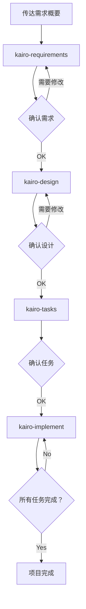

# Tsumiki 手册

## 使用方法

### 设置

在使用项目之前，首先将 `commands` 目录的内容复制到Claude的命令目录：

```bash
# 将项目的commands目录复制到.claude/commands
cp -r commands ~/.claude/commands/

# 或者，在项目目录内
mkdir -p .claude
cp -r commands .claude/
```

### TDD命令

如果在TASK创建时判定为 `TDD` 并希望单独执行TDD过程，可以按顺序运行以下命令：

```
# TDD需求定义
/tdd-requirements 任务文件名 TASK编号

# 测试用例创建
/tdd-testcases 任务文件名 TASK编号

# 从测试实现到TDD完成确认的自动化
/tdd-cycle-full.sh "任务文件名 TASK编号"

# 测试实现（Red）
/tdd-red 任务文件名 TASK编号

# 最小实现（Green）
/tdd-green 任务文件名 TASK编号

# 重构
/tdd-refactor 任务文件名 TASK编号

# TDD完成确认
/tdd-verify-complete 任务文件名 TASK编号
```

### DIRECT命令

如果在TASK创建时判定为 `DIRECT`，可以按顺序运行以下命令：

```
# DIRECT准备
/direct-setup 任务文件名 TASK编号

# DIRECT验证
/direct-verify 任务文件名 TASK编号
```

### Kairo命令（综合流程）

#### 1. 需求定义

首先，向Kairo传达项目需求概要：

```
/kairo-requirements 需求概要

# 提示示例：
# "我想实现电商网站的商品评价功能。
#  用户可以对商品发布5级评价和评论，
#  并可以参考其他用户的评价。"
```

Kairo生成以下内容：
- 用户故事
- 使用EARS记法的详细需求定义
- 边缘情况考虑
- 验收标准

生成的文件：`/docs/spec/{需求名}-requirements.md`

#### 2. 设计

确认和修改需求后，请求设计：

```
/kairo-design（或可省略）

# 请告知需求已被批准
```

Kairo生成以下内容：
- 架构设计文档
- 数据流图（Mermaid）
- TypeScript接口定义
- 数据库模式
- API端点规范

生成的文件：`/docs/design/{需求名}/` 目录下

#### 3. 任务分割

确认设计后（可省略批准），执行任务分割：

```
/kairo-tasks

# 请告知设计已被批准（或可省略）
```

建议运行 `/kairo-task-verify` 来验证任务内容。

Kairo生成以下内容：
- 考虑依赖关系的任务列表
- 各任务的详细信息（包括测试需求、UI/UX需求）
- 执行顺序和时间表

生成的文件：`/docs/tasks/{需求名}-tasks.md`

#### 4. 实现

确认任务后，开始实现：
（建议手动执行TDD循环或DIRECT）

```
# 按顺序实现所有任务
/kairo-implement

# 仅实现特定任务
/kairo-implement 任务文件名 TASK编号
# "请实现TASK-101"
```

Kairo内部对每个任务使用TDD命令执行以下过程：
1. TDD需求定义（tdd-requirements）
2. 测试用例创建（tdd-testcases）
3. 测试实现（tdd-red）
4. 最小实现（tdd-green）
5. 重构（tdd-refactor）
6. TDD完成确认（tdd-verify-complete）

### 逆向工程命令

如果要从现有代码库逆向生成各种文档，可以按顺序运行以下命令：

```
# 从现有代码分析任务结构
/rev-tasks

# 设计文档逆向生成（建议在任务分析后）
/rev-design

# 测试规范逆向生成（建议在设计文档后）
/rev-specs

# 需求定义逆向生成（建议在完整分析后）
/rev-requirements
```

#### 逆向工程详细说明

##### 概述

逆向工程命令分析现有代码库，从实现反推生成各种文档。

##### 推荐执行顺序

1. **rev-tasks** - 分析整个代码库以理解任务结构
2. **rev-design** - 生成架构和设计文档
3. **rev-specs** - 生成测试规范和测试用例
4. **rev-requirements** - 最后生成需求定义文档

##### 各命令详细说明

###### rev-tasks（任务结构分析）

**目的**：从现有代码中提取并整理已实现功能作为任务

**生成的文件**：
- `docs/reverse/{项目名}-discovered-tasks.md`

**分析内容**：
- 掌握代码库结构
- 识别已实现功能
- 提取API端点
- 分析数据库结构
- 估计任务依赖关系

###### rev-design（设计文档逆向生成）

**目的**：从已实现的架构生成技术设计文档

**生成的文件**：
- `docs/reverse/{项目名}-architecture.md`
- `docs/reverse/{项目名}-dataflow.md`
- `docs/reverse/{项目名}-api-specs.md`
- `docs/reverse/{项目名}-database.md`
- `docs/reverse/{项目名}-interfaces.ts`

**分析内容**：
- 识别架构模式
- 提取数据流
- 提取API规范
- 逆向生成数据库模式
- 整理TypeScript类型定义

###### rev-specs（测试规范逆向生成）

**目的**：从实现代码逆向生成测试用例和规范

**生成的文件**：
- `docs/reverse/{项目名}-test-specs.md`
- `docs/reverse/{项目名}-test-cases.md`
- `docs/reverse/tests/` - 生成的测试代码

**分析内容**：
- 分析现有测试
- 识别缺失的测试用例
- 生成API测试用例
- 生成UI组件测试
- 提出性能和安全测试建议

###### rev-requirements（需求定义逆向生成）

**目的**：从已实现功能用EARS记法逆向生成需求定义文档

**生成的文件**：
- `docs/reverse/{项目名}-requirements.md`

**分析内容**：
- 反推用户故事
- 使用EARS记法进行需求分类
- 估计非功能需求
- 识别边缘情况
- 生成验收标准

##### 使用示例

```bash
# 项目的完整逆向分析
/rev-tasks
# → 理解任务结构

/rev-design
# → 文档化架构和设计

/rev-specs
# → 分析测试状态并识别缺失测试

/rev-requirements
# → 最终生成需求定义文档
```

##### 注意事项

- 请务必审查每个步骤生成的内容
- 估计的需求可能与实际业务需求不同
- 测试用例是从实现状态估计的，可能不完整

## 目录结构

```
/projects/ai/test18/
├── .claude/
│   └── commands/           # Kairo命令
├── docs/
│   ├── spec/              # 需求定义文档
│   ├── design/            # 设计文档
│   ├── tasks/             # 任务列表
│   └── reverse/           # 逆向文档
├── implementation/        # 实现代码
│   └── {需求名}/
│       └── {任务ID}/
├── backend/              # 后端代码
├── frontend/             # 前端代码
└── database/             # 数据库相关
```

## 工作流程示例



## 优点

1. **一致的开发过程**
   - 从需求到实现的统一流程
   - 使用EARS记法的清晰需求定义

2. **质量保证**
   - 通过TDD命令实现稳健的实现
   - 全面的测试覆盖

3. **高效开发**
   - 自动任务分割和优先级排序
   - 依赖关系可视化

4. **全面的文档**
   - 需求、设计和实现全部文档化
   - 便于后续参考

## 注意事项

- 各步骤都会请求用户确认
- 请务必审查生成的内容
- 可能需要根据项目特性进行调整

## 故障排除

### Q: 需求过于复杂怎么办？
A: 将需求分割为多个较小的功能，分别对每个功能运行Kairo。

### Q: 可以应用于现有代码库吗？
A: 可以。在分析现有代码的基础上，可用于新功能添加或修改。

### Q: 可以自定义吗？
A: 可以。通过编辑各命令文件，可以进行项目特定的自定义。

## 支持

如有问题或疑问，请在项目的问题跟踪器中报告。