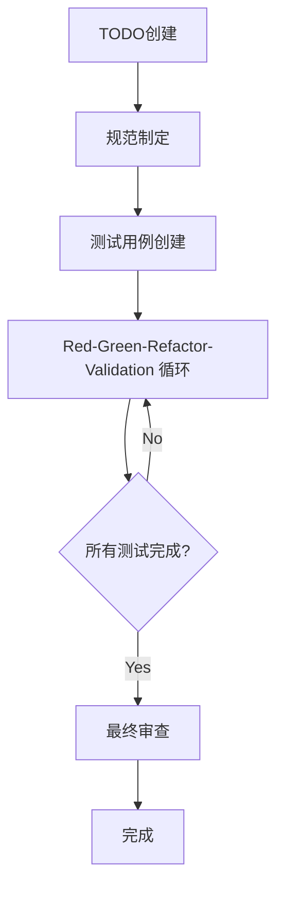

# 3.1 扩展TDD过程的整体流程

## AITDD过程概述

AITDD是将AI的力量与传统TDD（测试驱动开发）相结合，并添加了**Validation**步骤的扩展开发方法论。通过人类和AI的协作，可以高效地开发高质量软件。

## 整体流程结构



### 基本过程流程

```
TODO创建 → 规范制定 → 测试用例创建 → Red-Green-Refactor-Validation → 最终审查
```

## 各步骤详细说明

### 1. TODO创建（由人类负责）

**目的**：明确定义开发任务，并分解为适当的工作单位

**工作内容**：
- 功能需求的梳理
- 开发任务的细分
- 优先级设置
- 工作范围明确化

**成果物**：TODO.md文件
- 具体且可实现单位的任务清单
- 每个任务的优先级和依赖关系
- 完成条件的定义

### 2. 规范制定（由人类负责，必须审查）

**目的**：从TODO制定详细技术规范

**工作内容**：
- 功能详细规范的定义
- 输入输出的明确化
- 错误处理方针制定
- 性能需求设置

**重要要点**：
- **人类审查是必须的**
- 参考AI的建议，但最终判断由人类进行
- 排除规范的模糊性

**成果物**：requirements.md文件
- 功能需求的详细说明
- 技术约束
- 质量需求

### 3. 测试用例创建（由人类负责，必须审查）

**目的**：基于规范设计全面的测试用例

**工作内容**：
- 正常路径测试用例设计
- 异常路径测试用例设计
- 边界值测试计划
- 边缘案例识别

**重要要点**：
- **人类审查是必须的**
- 确保测试用例的覆盖性
- 验证与规范的一致性

**成果物**：testcases.md文件
- 测试用例清单
- 期望行为的详细说明
- 测试数据定义

### 4. Red-Green-Refactor-Validation循环（主要由AI负责）

扩展传统TDD循环，添加了**Validation**步骤。此循环几乎全部由AI执行，但在人类监督下进行。

#### Red（测试失败）
- 测试用例实现
- 确认期望的失败
- 测试执行和失败确认

#### Green（最小实现）
- 通过测试的最小实现
- AI自动代码生成
- 测试成功确认

#### Refactor（重构）
- 代码质量改善
- AI优化
- 提高可读性和可维护性

#### Validation（验证）
- 实现适当性验证
- 质量检查
- 额外验证项目确认

### 5. 最终审查（由人类负责）

**目的**：最终确认生成代码整体的质量和规范符合性

**工作内容**：
- 源代码详细审查
- 与规范一致性确认
- 安全检查
- 性能验证

**重要要点**：
- **必须由人类实施**
- AI生成代码的最终质量保证
- 生产投入前的最后防线

## AI和人类的角色分工

### AI（Claude等）负责的领域

- **Red-Green-Refactor-Validation循环的执行**
  - 测试用例实现
  - 生产代码生成
  - 重构执行
  - 质量验证支持

- **代码生成和优化**
  - 高效算法实现
  - 遵循编码规范的实现
  - 自动代码改善

- **自动测试执行**
  - 测试执行和结果确认
  - 测试覆盖率测量
  - 持续质量检查

### 人类负责的领域

- **战略判断**
  - 规范制定和审查
  - 测试用例设计和审查
  - 架构决定

- **质量管理**
  - 最终源代码审查
  - 安全需求确认
  - 业务需求符合性确认

- **创造性工作**
  - 问题解决方法决定
  - 用户体验设计
  - 技术选择判断

## 与传统TDD的比较

| 项目 | 传统TDD | AITDD |
|------|---------|--------|
| **循环** | Red-Green-Refactor | Red-Green-Refactor-**Validation** |
| **实现主体** | 人类 | **AI**（人类监督下） |
| **审查** | 仅实现后 | **规范・测试・最终代码** |
| **速度** | 依赖人类实现速度 | **AI支持大幅加速** |
| **质量管理** | 依赖开发者技能 | **多层质量检查** |
| **学习成本** | 需要掌握TDD | **TDD + AI活用技能** |

## 过程优势

### 1. 开发速度提升
- 通过AI自动代码生成大幅缩短实现时间
- 重复任务自动化
- 测试执行和反馈加速

### 2. 质量提升
- 通过Validation步骤进行额外质量检查
- 人类和AI的双重检查体制
- 一致质量标准的应用

### 3. 知识活用
- AI活用最新技术和最佳实践
- 经验不足的开发者也能生成高质量代码
- 自动活用领域知识

### 4. 持续改善
- 通过AI反馈的学习效果
- 过程本身的持续优化
- 团队整体技能提升

## 注意事项和风险管理

### 1. 避免过度依赖AI
- 重要判断必须由人类进行
- 不要盲目接受AI建议
- 持续深化技术理解

### 2. 强化质量管理
- 多阶段审查实施
- 自动测试和手动测试并用
- 确实确认安全需求

### 3. 过程灵活性
- 根据项目调整过程
- 根据团队技能水平应用
- 持续过程改善

## 下一步

第3章将详细解释此过程的各个步骤：

- [3.2 TODO创建和规范制定](./02-todo-and-specification.md)
- [3.3 测试用例创建](./03-test-case-creation.md)
- [3.4 Red-Green-Refactor-Validation循环](./04-rgr-validation-cycle.md)
- [3.5 Validation步骤详细说明](./05-validation-details.md)

学习各步骤的具体程序和技巧，能够在实际中实践AITDD。