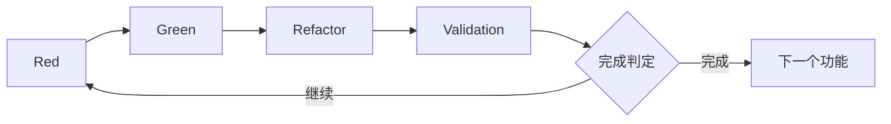

# 3.4 Red-Green-Refactor-Validation循环

## 扩展TDD循环概述

AITDD的核心是在传统TDD（Red-Green-Refactor）基础上添加**Validation**步骤的扩展循环。该循环主要由AI执行，但在人工监督下进行，高效生成高质量代码。



## Red-Green-Refactor-Validation循环详解

### Red阶段：确认测试失败

#### 目的
- 实现测试用例
- 确认测试按预期失败
- 验证测试本身的正确性

#### 具体工作内容

##### 1. 测试用例实现
```javascript
// 示例：用户注册功能测试实现
describe('User Registration', () => {
  test('should create user with valid data', async () => {
    const userData = {
      email: 'test@example.com',
      password: 'SecurePass123!',
      password_confirmation: 'SecurePass123!'
    };
    
    const response = await request(app)
      .post('/api/users')
      .send(userData);
    
    expect(response.status).toBe(201);
    expect(response.body).toHaveProperty('id');
    expect(response.body.email).toBe(userData.email);
    
    // 数据库确认
    const user = await User.findByEmail(userData.email);
    expect(user).toBeTruthy();
    expect(user.password_hash).not.toBe(userData.password);
  });
  
  test('should reject duplicate email', async () => {
    // 预先创建现有用户
    await createUser({ email: 'existing@example.com' });
    
    const duplicateData = {
      email: 'existing@example.com',
      password: 'NewPass456!'
    };
    
    const response = await request(app)
      .post('/api/users')
      .send(duplicateData);
    
    expect(response.status).toBe(400);
    expect(response.body.error).toBe('validation_failed');
    expect(response.body.details[0].field).toBe('email');
  });
});
```

##### 2. 测试执行和失败确认
```bash
$ npm test
❌ User Registration › should create user with valid data
   Error: Cannot POST /api/users
   
❌ User Registration › should reject duplicate email
   Error: Cannot POST /api/users
```

##### 3. 失败原因确认
- 端点未实现
- 缺少必需的依赖关系
- 测试环境配置问题

#### AI执行Red阶段

##### 提示词示例
```markdown
## 指令：执行Red阶段

### 背景
- 功能：用户注册API
- 测试用例规格：参考testcases.md
- 现有代码：检查src/目录

### 执行内容
1. 将testcases.md中的每个测试用例实现为Jest测试
2. 运行测试并确认按预期失败
3. 整理并报告失败原因

### 输出格式
- 测试代码（完整版）
- 测试执行结果
- 失败原因分析
- 下一个Green阶段的建议
```

### Green阶段：最小实现

#### 目的
- 实现通过测试的最小代码
- 避免过度实现，保持测试驱动方法
- 为下一个Refactor阶段留出改进空间

#### 具体工作内容

##### 1. 最小API实现
```javascript
// routes/users.js
const express = require('express');
const bcrypt = require('bcrypt');
const User = require('../models/User');
const router = express.Router();

router.post('/users', async (req, res) => {
  try {
    const { email, password, password_confirmation } = req.body;
    
    // 基本验证
    if (!email || !password || !password_confirmation) {
      return res.status(400).json({
        error: 'validation_failed',
        details: [{ field: 'required', message: 'Missing required fields' }]
      });
    }
    
    if (password !== password_confirmation) {
      return res.status(400).json({
        error: 'validation_failed',
        details: [{ field: 'password', message: 'Password confirmation does not match' }]
      });
    }
    
    // 重复检查
    const existingUser = await User.findByEmail(email);
    if (existingUser) {
      return res.status(400).json({
        error: 'validation_failed',
        details: [{ field: 'email', message: 'Email already exists' }]
      });
    }
    
    // 密码哈希化
    const password_hash = await bcrypt.hash(password, 10);
    
    // 用户创建
    const user = await User.create({
      email,
      password_hash
    });
    
    res.status(201).json({
      id: user.id,
      email: user.email,
      created_at: user.created_at
    });
    
  } catch (error) {
    console.error('User creation error:', error);
    res.status(500).json({ error: 'Internal server error' });
  }
});

module.exports = router;
```

##### 2. 最小模型实现
```javascript
// models/User.js
const db = require('../database');

class User {
  static async findByEmail(email) {
    const result = await db.query(
      'SELECT * FROM users WHERE email = ?',
      [email]
    );
    return result[0] || null;
  }
  
  static async create({ email, password_hash }) {
    const result = await db.query(
      'INSERT INTO users (email, password_hash, created_at) VALUES (?, ?, NOW())',
      [email, password_hash]
    );
    
    return {
      id: result.insertId,
      email,
      created_at: new Date()
    };
  }
}

module.exports = User;
```

##### 3. 测试执行和成功确认
```bash
$ npm test
✅ User Registration › should create user with valid data
✅ User Registration › should reject duplicate email

Tests: 2 passed, 2 total
```

#### AI执行Green阶段

##### 提示词示例
```markdown
## 指令：执行Green阶段

### 背景
- 失败的测试：[Red阶段结果]
- 需求：参考requirements.md
- 现有代码结构：检查src/目录

### 执行内容
1. 实现通过失败测试的最小代码
2. 避免需求的过度实现
3. 通过测试执行确认所有用例通过

### 约束条件
- 遵守最小实现原则
- 不实现测试用例之外的功能
- 与现有代码保持一致性

### 输出格式
- 实现代码（完整版）
- 测试执行结果
- 实现方法说明
```

### Refactor阶段：代码改进

#### 目的
- 提高代码质量
- 增强可维护性和可读性
- 优化性能
- 保持测试持续通过

#### 具体工作内容

##### 1. 代码结构改进
```javascript
// services/UserService.js - 业务逻辑分离
class UserService {
  constructor(userRepository, passwordHasher) {
    this.userRepository = userRepository;
    this.passwordHasher = passwordHasher;
  }
  
  async createUser({ email, password, password_confirmation }) {
    // 验证
    this.validateUserInput({ email, password, password_confirmation });
    
    // 重复检查
    await this.checkEmailUniqueness(email);
    
    // 用户创建
    const password_hash = await this.passwordHasher.hash(password);
    return await this.userRepository.create({ email, password_hash });
  }
  
  validateUserInput({ email, password, password_confirmation }) {
    const errors = [];
    
    if (!this.isValidEmail(email)) {
      errors.push({ field: 'email', message: 'Invalid email format' });
    }
    
    if (!this.isValidPassword(password)) {
      errors.push({ field: 'password', message: 'Password does not meet requirements' });
    }
    
    if (password !== password_confirmation) {
      errors.push({ field: 'password_confirmation', message: 'Password confirmation does not match' });
    }
    
    if (errors.length > 0) {
      throw new ValidationError(errors);
    }
  }
  
  async checkEmailUniqueness(email) {
    const existingUser = await this.userRepository.findByEmail(email);
    if (existingUser) {
      throw new ValidationError([{ field: 'email', message: 'Email already exists' }]);
    }
  }
  
  isValidEmail(email) {
    const emailRegex = /^[^\s@]+@[^\s@]+\.[^\s@]+$/;
    return email && email.length <= 254 && emailRegex.test(email);
  }
  
  isValidPassword(password) {
    if (!password || password.length < 8) return false;
    
    const hasUpperCase = /[A-Z]/.test(password);
    const hasLowerCase = /[a-z]/.test(password);
    const hasNumbers = /\d/.test(password);
    const hasSymbols = /[!@#$%^&*()_+\-=\[\]{};':"\\|,.<>\/?]/.test(password);
    
    return hasUpperCase && hasLowerCase && hasNumbers && hasSymbols;
  }
}

// 控制器简化
router.post('/users', async (req, res) => {
  try {
    const user = await userService.createUser(req.body);
    res.status(201).json({
      id: user.id,
      email: user.email,
      created_at: user.created_at
    });
  } catch (error) {
    if (error instanceof ValidationError) {
      return res.status(400).json({
        error: 'validation_failed',
        details: error.details
      });
    }
    
    console.error('User creation error:', error);
    res.status(500).json({ error: 'Internal server error' });
  }
});
```

##### 2. 错误处理改进
```javascript
// errors/ValidationError.js
class ValidationError extends Error {
  constructor(details) {
    super('Validation failed');
    this.name = 'ValidationError';
    this.details = details;
  }
}

// middlewares/errorHandler.js
const errorHandler = (error, req, res, next) => {
  if (error instanceof ValidationError) {
    return res.status(400).json({
      error: 'validation_failed',
      details: error.details
    });
  }
  
  console.error('Unhandled error:', error);
  res.status(500).json({ error: 'Internal server error' });
};
```

##### 3. 通过测试执行确认质量维护
```bash
$ npm test
✅ User Registration › should create user with valid data
✅ User Registration › should reject duplicate email
✅ User Registration › should validate email format
✅ User Registration › should validate password strength

Tests: 4 passed, 4 total
```

#### AI执行Refactor阶段

##### 提示词示例
```markdown
## 指令：执行Refactor阶段

### 背景
- 当前代码：[Green阶段交付物]
- 测试状态：所有测试通过
- 质量目标：提高可维护性、可读性、性能

### 执行内容
1. 代码结构改进（关注点分离、DRY原则）
2. 错误处理统一
3. 性能优化
4. 编码规范应用
5. 通过测试执行确认质量维护

### 约束条件
- 不破坏现有测试
- 避免过度的架构变更
- 重视渐进式改进

### 输出格式
- 重构后的代码
- 改进点说明
- 测试执行结果
```

### Validation阶段：综合验证

#### 目的
- 综合验证实现的有效性
- 确认符合质量标准
- 评估额外测试用例的必要性
- 进行完成判定

#### 具体验证项目

##### 1. 已实现测试用例确认
```markdown
## 测试用例实现状态检查

### 计划测试用例（来自testcases.md）
- [x] TC001：正常用户注册
- [x] TC002：邮箱地址重复错误
- [x] TC003：密码不匹配错误
- [x] TC004：无效邮箱地址格式
- [x] TC005：密码强度不足
- [x] TC006：必填字段缺失
- [x] TC007：边界测试 - 邮箱地址长度
- [ ] TC008：速率限制测试（未实现）
- [ ] TC009：数据库连接错误（未实现）
- [x] TC010：CSRF令牌验证

### 实现率：80% (8/10)
```

##### 2. 现有测试回归确认
```bash
$ npm test
✅ User Authentication › should login with valid credentials
✅ User Authentication › should reject invalid password
✅ User Registration › should create user with valid data
✅ User Registration › should reject duplicate email
✅ Product Management › should create product
✅ Product Management › should list products

Tests: 6 passed, 6 total
Time: 2.341s
```

##### 3. 代码质量指标确认
```bash
$ npm run quality-check
✅ ESLint: 0 errors, 0 warnings
✅ Test Coverage: 95% statements, 92% branches
✅ Code Complexity: Average 3.2 (Good)
✅ Dependency Check: No vulnerabilities found
```

##### 4. 规格适合性确认
```markdown
## 规格适合性检查

### 功能需求
- [x] 通过email/password进行新用户注册
- [x] 重复email验证
- [x] 密码强度检查
- [x] 密码哈希化（bcrypt）

### 非功能需求
- [x] 响应时间：平均1.2秒（2秒以内）
- [ ] 并发注册：未进行负载测试
- [x] 密码哈希化必须

### API规格
- [x] POST /api/users端点
- [x] 期望的请求/响应格式
- [x] 适当的HTTP状态码

### 数据库设计
- [x] users表设计
- [x] 适当的索引
- [x] 约束实现
```

##### 5. 安全需求确认
```markdown
## 安全检查

### 密码管理
- [x] 无密码明文存储
- [x] bcrypt哈希化
- [x] 适当的盐使用

### 输入验证
- [x] SQL注入防护
- [x] XSS防护
- [x] CSRF令牌验证

### 访问控制
- [x] 适当的HTTP状态码
- [x] 错误信息的适当限制
```

#### AI执行Validation阶段

##### 提示词示例
```markdown
## 指令：执行Validation阶段

### 背景
- 实现完成代码：[Refactor阶段交付物]
- 需求定义：requirements.md
- 测试用例：testcases.md
- 现有系统：整体代码库

### 验证项目
1. 检查testcases.md中列出的所有测试用例实现状态
2. 对现有测试执行回归测试
3. 确认requirements.md需求的满足情况
4. 测量代码质量指标
5. 确认安全需求

### 完成判定标准
- 计划测试用例90%以上实现
- 现有测试全部通过
- 重要需求100%满足
- 无重大安全问题

### 输出格式
- 验证结果报告
- 未实现测试用例列表
- 质量指标
- 完成/继续的判定理由
```

#### Validation阶段判定标准

##### ✅ 完成判定（自动进入下一步）
```markdown
### 完成条件
- 现有测试状态：全部通过
- 测试用例实现率：90%以上
- 重要需求完成率：100%
- 代码覆盖率：80%以上
- 安全检查：无重大问题
```

##### ⚠️ 继续判定（需要额外实现）
```markdown
### 继续条件
- 现有测试：有失败
- 测试用例实现率：低于90%
- 重要需求：有未满足项目
- 质量指标：低于标准值
- 安全：发现重大问题
```

## 整体循环管理

### 过程控制

#### 1. 循环执行自动化
```markdown
## AITDD执行脚本示例

### 输入
- requirements.md
- testcases.md
- 现有代码库

### 执行流程
1. Red：测试用例实现·执行
2. Green：最小实现
3. Refactor：代码改进
4. Validation：综合验证
5. 判定：完成/继续的自动判定

### 输出
- 实现代码
- 测试结果
- 质量报告
- 下一步推荐事项
```

#### 2. 进度可视化
```markdown
## 进度跟踪

### 测试用例进度
- 已实现：8/10 (80%)
- 成功：8/8 (100%)
- 失败：0/8 (0%)

### 质量指标
- 覆盖率：95%
- 复杂度：3.2 (良好)
- 重复度：2% (良好)

### 需求满足度
- 功能需求：100%
- 非功能需求：80%
- 安全需求：100%
```

### 人工介入点

#### 1. 需要重要判断的情况
- 架构的大幅变更
- 安全需求的解释
- 性能需求的调整
- 业务逻辑的复杂判断

#### 2. 质量标准调整
- 测试覆盖率的目标值
- 代码复杂度的容忍值
- 性能需求的重新审视

#### 3. 过程优化
- 循环执行时间改进
- AI指令精度提升
- 自动化范围扩大

## 错误处理和调试

### 常见问题及其解决方法

#### 1. Red阶段测试未正确失败
**原因**：测试用例实现错误、环境配置问题
**解决**：重新确认测试用例规格、环境初始化

#### 2. Green阶段过度实现
**原因**：对最小实现原则理解不足
**解决**：彻底执行测试驱动、明确实现范围

#### 3. Refactor阶段测试破坏
**原因**：重构中的逻辑变更
**解决**：渐进式重构、持续测试执行

#### 4. Validation阶段标准未达
**原因**：需求理解不足、质量标准设置错误
**解决**：重新确认需求、调整标准值

## 下一步

理解了Red-Green-Refactor-Validation循环后，继续学习[Validation步骤详细](./05-validation-details.md)以掌握更深入的质量管理技术。

### 学习要点
- [ ] 理解了各阶段的目的和执行内容
- [ ] 掌握了AI和人工的角色分工
- [ ] 获得了整体循环的质量管理技术
- [ ] 学习了错误处理的基本模式

通过掌握这个循环，您将能够在最大限度发挥AI能力的同时高效开发高质量软件。