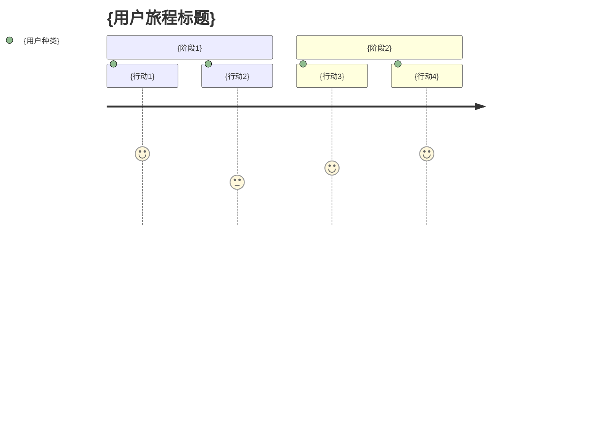

# kairo-requirements

## 目的

分析用户提供的需求概要，使用EARS（Easy Approach to Requirements Syntax）记法创建包含详细验收标准的需求定义书。

## 前提条件

- 用户已提供需求概要
- `docs/spec/` 目录存在（如不存在则创建）

## 执行内容

**【可靠性水平指示】**:
对于各个项目，请使用以下信号注释与原始资料（EARS需求定义书・设计文档等）的对照状况：

- 🟢 **绿色信号**: 参考EARS需求定义书・设计文档几乎没有推测的情况
- 🟡 **黄色信号**: 从EARS需求定义书・设计文档进行合理推测的情况
- 🔴 **红色信号**: 在EARS需求定义书・设计文档中没有的推测情况

1. **需求分析**
   - 理解用户提供的需求概要
   - 应用相关领域知识
   - 在不明确的地方基于一般最佳实践进行补充

2. **用户故事创建**
   - 以WHO（谁）、WHAT（什么）、WHY（为什么）的格式描述
   - 明确各功能的价值

3. **使用EARS记法的需求定义**
   - **通常需求（SHALL）**: 系统通常应执行的动作
   - **条件付需求（WHEN/IF-THEN）**: 特定条件下的动作
   - **状态需求（WHERE）**: 特定状态下的动作
   - **可选需求（MAY）**: 任意功能
   - **约束需求（MUST）**: 系统约束事项

4. **边缘案例定义**
   - 异常系统处理
   - 边界值处理
   - 错误处理
   - 性能需求

5. **文件创建**
   - `docs/spec/{需求名}-requirements.md`: 功能需求和相关文档链接
   - `docs/spec/{需求名}-user-stories.md`: 详细用户故事
   - `docs/spec/{需求名}-acceptance-criteria.md`: 验收标准和测试项目
   - 创建Markdown格式的结构化文档

## 输出格式示例

### 1. requirements.md（主文件）

```markdown
# {需求名} 需求定义书

## 概要

{需求概要}

## 相关文档

- **用户故事**: [📖 {需求名}-user-stories.md]({需求名}-user-stories.md)
- **验收标准**: [✅ {需求名}-acceptance-criteria.md]({需求名}-acceptance-criteria.md)

## 功能需求（EARS记法）

### 通常需求

- REQ-001: 系统应 {通常动作}
- REQ-002: 系统应 {通常动作}

### 条件付需求

- REQ-101: 当 {条件} 时，系统应 {动作}
- REQ-102: 当 {条件} 时，系统应 {动作}

### 状态需求

- REQ-201: 在 {状态} 时，系统应 {动作}

### 可选需求

- REQ-301: 系统可以 {可选功能}

### 约束需求

- REQ-401: 系统必须 {约束事项}

## 非功能需求

### 性能

- NFR-001: {性能需求}

### 安全性

- NFR-101: {安全需求}

### 可用性

- NFR-201: {可用性需求}

## 边缘案例

### 错误处理

- EDGE-001: {错误案例}

### 边界值

- EDGE-101: {边界值案例}
```

### 2. user-stories.md（详细用户故事）

```markdown
# {需求名} 用户故事

## 概要

本文档记载{需求名}功能的详细用户故事。

## 用户种类定义

### 主要用户

- **最终用户**: {最终用户详细说明}
- **管理员**: {管理员详细说明}
- **开发者**: {开发者详细说明}

### 次要用户

- **系统管理员**: {系统管理员详细说明}
- **外部系统**: {外部系统详细说明}

## 用户故事

### 📚 史诗1: {大功能组}

#### 故事1.1: {具体故事名}

**用户故事**:
- **作为** {用户种类}
- **在** {具体情况・上下文} 中
- **我想要** {期望实现的行动・操作}
- **以便** {获得的价值・解决的问题}

**详细说明**:
- **背景**: {为什么需要这个功能}
- **前提条件**: {这个故事的前提情况}
- **使用场景**: {具体使用场面的例子}
- **期望体验**: {用户期望体验的详细}

**相关需求**: REQ-001, REQ-002

**优先级**: 高/中/低

**估算**: {故事点或工时}

#### 故事1.2: {具体故事名}

{以同样格式记载}

### 📚 史诗2: {大功能组}

{以同样格式记载}

## 用户旅程

### 旅程1: {代表性使用流程}



**详细**:
1. **{行动1}**: {详细说明}
2. **{行动2}**: {详细说明}

## 角色定义

### 角色1: {代表用户名}

- **基本信息**: {年龄、职业、技术水平等}
- **目标**: {这个用户想要达成的事}
- **课题**: {现在面临的问题}
- **行为模式**: {典型行为特征}
- **使用环境**: {使用的设备、环境等}

## 非功能用户需求

### 可用性需求

- **学习容易性**: {初次使用时的学习成本}
- **效率性**: {熟练后的作业效率}
- **记忆容易性**: {再次使用时的记忆容易性}
- **错误对应**: {错误时的对应容易性}
- **满意度**: {主观满意度}

### 可访问性需求

- **视觉**: {对视觉障碍者的照顾}
- **听觉**: {对听觉障碍者的照顾}
- **运动**: {对运动功能障碍者的照顾}
- **认知**: {对认知障碍者的照顾}
```

### 3. acceptance-criteria.md（验收标准）

```markdown
# {需求名} 验收标准

## 概要

本文档记载{需求名}功能的验收标准和测试项目。

## 功能测试标准

### REQ-001: {需求名} 验收标准

**Given（前提条件）**:
- {测试执行前的状态}
- {必要的初始数据}

**When（执行条件）**:
- {执行的行动}
- {输入的数据}

**Then（期待结果）**:
- {期待的输出・状态}
- {应确认的副作用}

**测试案例**:
- [ ] 正常系: {正常案例详细}
- [ ] 异常系: {异常案例详细}
- [ ] 边界值: {边界值测试详细}

### REQ-002: {需求名} 验收标准

{以同样格式记载}

## 非功能测试标准

### 性能测试

**NFR-001: {性能需求}**

- [ ] 响应时间: {具体时间标准}
- [ ] 吞吐量: {处理量标准}
- [ ] 同时连接数: {同时用户数标准}
- [ ] 资源使用量: {CPU・内存使用量标准}

**测试方法**:
- 负载测试工具: {使用的工具}
- 测试场景: {具体测试步骤}
- 合格标准: {定量合格线}

### 安全性测试

**NFR-101: {安全需求}**

- [ ] 认证: {认证功能测试项目}
- [ ] 授权: {权限控制测试项目}
- [ ] 数据保护: {数据加密测试项目}
- [ ] 脆弱性: {安全脆弱性测试项目}

## 可用性测试标准

### UX/UI测试

- [ ] 直观操作性: {操作易懂性}
- [ ] 响应式设计: {各设备显示}
- [ ] 可访问性: {WCAG 2.1遵循}
- [ ] 错误消息: {易懂的错误显示}

**测试方法**:
- 可用性测试: {实施方法}
- A/B测试: {比较测试方法}
- 可访问性检查: {使用工具}

## 边缘案例测试标准

### EDGE-001: {错误案例} 验收标准

**测试场景**:
- {异常情况设置}
- {期待的错误处理}
- {向用户适当通知}

**合格标准**:
- [ ] 系统不崩溃
- [ ] 显示适当错误消息
- [ ] 保持数据一致性
- [ ] 维持可恢复状态

## 集成测试标准

### 系统间联系测试

- [ ] 外部API联系: {与外部系统的联系测试}
- [ ] 数据库联系: {DB操作一致性测试}
- [ ] 文件系统: {文件操作测试}

## 回归测试标准

### 既有功能影响确认

- [ ] 既有功能动作确认: {影响范围特定和确认}
- [ ] 性能劣化确认: {既有功能性能确认}
- [ ] 安全设置确认: {安全功能持续确认}

## 验收测试执行检查单

### 测试执行前

- [ ] 测试环境准备完成
- [ ] 测试数据准备完成
- [ ] 测试工具准备完成
- [ ] 执行负责人确认完成

### 测试执行中

- [ ] 全功能测试执行
- [ ] 全非功能测试执行
- [ ] 问题发现时记录
- [ ] 修正后重新测试

### 测试完成后

- [ ] 测试结果记录
- [ ] 残存问题整理
- [ ] 验收可否判定
- [ ] 向利益相关者报告
```

## 执行后确认

- 显示创建的3个文件路径
  - `docs/spec/{需求名}-requirements.md`
  - `docs/spec/{需求名}-user-stories.md`
  - `docs/spec/{需求名}-acceptance-criteria.md`
- 报告主要需求数和用户故事数
- 确认各文件内链接正确设置
- 显示促进用户确认的消息